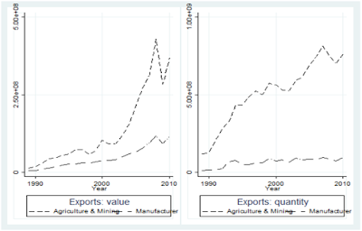

Trade between African countries only represents 15 percent of their exchange with the world. This is a small percentage in comparison with other continents: internal trade between North American countries represents almost 50 percent of their total trade, similar numbers can be found for Asia, and to a lesser extent for South American countries (around 30 percent). This is all the more disappointing given that for more than forty years, African countries have enforced different Regional Trade Agreements (RTAs) going from free trade areas, to common markets, to political and currency unions and finally to monetary unions.

Can we conclude from these prima facie evidences that RTAs have been inefficient? We don't think so, there is a long list of individual and bilateral variables that can explain the weak continental integration (specialisation patterns, regional or civil conflicts, preferential agreements with developed countries, etc) that must be controlled before concluding on the usefulness of RTAs.

[In our study](https://www.tandfonline.com/doi/abs/10.1080/00036846.2019.1566691), working with historical data on international trade, we use a dummy of RTAs that varies over time enabling us to control for the various variables explaining trade by using country pair, importer-year, and exporter-year fixed effects. All the aforementioned RTAs in Africa enforced between 1955 and 2014 are analyzed.

We find that the effects of RTAs have been strong but the bulk of this trade creation occurred between 1955 and 1990. Regarding the nature of RTAs, while Economic Integration Agreements (EIAs) still favour trade in Africa, there was no trade creation coming from Free Trade Agreements between 1990 and 2014. In that period, when the heterogeneity of RTAs are taken into account, RTAs in general (EIAs and FTAs) have no effect. This lack of impact can have different causes, among which the content of the RTAs that has changed over time.

## Behind-the-Border Policies

Many recent RTAs in Africa include rules on capital mobility, competition and on environmental policies introducing hidden protection that may be detrimental for trade. As argued by Rodrick (2018) "free trade agreements" are less about "free trade" and more about behind-the-border policies (regulatory standards, investment etc) driven by rent-seeking behavior of well-connected firms that lead to inefficient trade agreements.

However, we find that these behind-the-border policies do not significantly deter trade in Africa.

## Home Market Effect in Africa?

Another reason explaining why contemporary RTAs have limited effects, may be found in their redistributive effects between members, improving the terms of trade of some countries at the expense of others.

In relatively large countries, economies of scale due to the domestic market size may explain why RTAs have fostered the creation of a disproportionate numbers of activities in these countries and not elsewhere.

In colloquial terms, this analysis refers to the literature on the "**Home Market Effect**" (Krugman, 1980; Crozet and Trionfetti, 2008; Costinot et al., 2017).

This theoretical hypothesis has not yet been tested for Africa since the continent is rightly viewed as being highly specialized on a limited number of agricultural goods. There are however some countries in Africa that may have attracted industrial activities in the way described by Krugman (1980).

Indeed the industrial sector in Africa is still underdeveloped but has known a particular increase as illustrated by the export of industrial goods of African countries.

Beyond that effect, we also test the "Hub Effect Hypothesis": with regional trade integration, a country with the best access to other markets can become a platform for exports, attracting and creating activities at the expense of countries with poor international networks (Puga and Venables, 1997; Ossa, 2011; Mossay and Tabuchi, 2015).

Overall we find that there is no home market effect due to RTAs, however there are hub effects!

If you are interested by the details of this analysis, you can find our paper here:

Fabien Candau (UPPA), Geoffroy Guepie (UN) & Julie Schlick (CEPII). Moving to autarky, trade creation and home market effect: an exhaustive analysis of regional trade agreements in Africa. *Applied Economics*, Pages 3293–3309, 2019 (also the [working paper version](https://www.freit.org/WorkingPapers/Papers/TradePolicyRegional/FREIT1603.pdf)).
