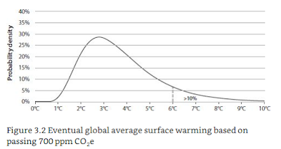

Quizz: le Botswana est surnommé:

1. la ferme de l'Afrique
2. la Suisse de l'Afrique

Il ne pleut presque jamais au Botswana, seulement 1% du territoire est cultivable. L'eau est tellement vénérée que le drapeau est bleu, que la monnaie "Pula" signifie "pluie" et que lorsqu'on pense à des lendemains radieux, on pense à des pluies torrentielles. Pour preuve, en 1966 au moment de l'indépendance le président Seretse Khama s'est écrié "let there be rain!" (Lynas, 2007). Alors, sans surprise, le Botswana n'est pas connu pour son agriculture mais pour ses diamants et pour son système bancaire, l'un des "meilleurs" d'Afrique.

Avec quelques degrés de plus à l'échelle du monde de nombreux pays vont souffrir de sécheresse et tous ne pourront pas être des paradis fiscaux (ou trouver des diamants). Soyons clair, 2 degrés, soit l'objectif de la COP21, c'est un climat hostile mais ça reste vivable (enfin pas partout...). Mais peut-on véritablement viser et atteindre précisément 2 degrés? Ne devrait-on pas plutôt avoir des objectifs sur des instruments (harmonisation de taxe, réglementation, marché CO2)? Le problème avec cet objectif de 2 degrés, c'est que la marge d'incertitude est grande, le réchauffement pourrait être bien plus élevé avec le *même* niveau *estimé* de pollution. Ces 2-3-4 degrés sont calculés par rapport aux émissions de gaz à effet de serre. Suivant ces émissions (dépendantes donc d'hypothèses sur le PIB, les technologies, le commerce etc) on calcule des probabilités de hausse de températures, en 2100 on devrait être à 700 ppm et en conséquence le scénario de 3 degrés est le plus probable (voir graphique ci-dessous extrait de Wagner et Weitzman, 2015). Mais notez qu'il y a au moins 10% de (mal)chance qu'avec ce *même niveau d'émission* on tape dans les 6 degrés de réchauffement! Si on fait plus que 700 ppm, la proba des 6 degrés augmente, elle passe à presque 20% avec 800 ppm.

Il est peu probable qu'on laisse la terre se réchauffer à une telle température (quoique...). Six degrés c'est un *come back* au crétacé qui n'est pas vraiment connu pour son abondance en mammifères, alors même avec des progrès techniques, la vie risque d'être très difficile, voire impossible dans de nombreux endroits.

Hélas, la COP21 ne sera pas un moment historique dans cette direction, discuter du degré de réchauffement, c'est forcément lancer un faux débat. Il vaudrait mieux débattre de la croissance continue des énergies que nous consommons pour des usages parfois bien futiles. Mais les appels à la morale et à la sobriété, sont peines perdues sans politiques incitatives (certains diront punitives, telles que taxe carbone, réglementation et interdiction) et redistributives; en démocratie il ne faut pas s'attendre à un plébiscite de ces politiques si elles sont fortement inégalitaires et pèsent sur les plus modestes.

Enfin la lutte contre le réchauffement climatique doit être coordonnée à l'échelle internationale, et s'il n'est pas possible de le faire à l'échelle globale, la constitution de "club climatique" qui mènent des politiques ambitieuses serait déjà un bon début. Voir sur ces sujets l'article de Nordhaus "[Climate Clubs: Overcoming Free-riding in International Climate Policy](http://ets.hbue.edu.cn/images_1/2015041354496217.pdf)" et celui de Weitzman "[Internalizing the Climate Externality: Can a Uniform Price Commitment Help?](http://carbon-price.com/wp-content/uploads/2015-07-weitzman-uniform-price-commitment.pdf)".

Le passage a une économie décarbonée est coûteuse, mais les coûts de l'absence de transition sont bien plus nombreux, outre les désastres environnementaux et humains que l'on commence à sérieusement mesurer, il implique à moyen terme une dépendance à des énergies non renouvelables dont les prix sont voués à augmenter et de plus exploitées dans des pays instables et risqués.

F.C.

## Biblio du post

- Lynas, Six Degrees, our Future on a Hotter Planet, Harper-Collins.
- Wagner et Weitzman (2015), Climate Shock, the Economic Consequences of a Hotter Planet. Princeton U Press.
