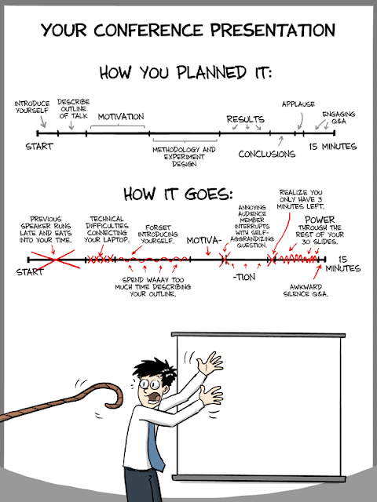

{width=480}

Quelques conseils pour:

- Faire une bonne [introduction (here it is)](http://blogs.ubc.ca/khead/research/research-advice/formula), le texte vient de Brander et de Head. C'est la méthode classique, "en entonnoir" (1. Hook, 2. Questions, 3. Antécédents, 4. Value-added 5. Road-map). Certaines personnes vous conseilleront d'être plus direct et de présenter rapidement votre contribution (cad de ne pas attendre la quatrième étape). C'est plus périlleux et nécessite un certain entraînement, si ce n'est un certain talent. Je conseille donc à ceux qui débutent la bonne vieille méthode de Brander et Head. Il faut cependant avouer que les lecteurs sont de plus en plus pressés et qu'une version déformant un peu l'entonnoir peut être très efficace, voici par exemple les premières lignes d'intro d'un papier de Behrens, Duranton et Robert-Nicoud: *"Output per capita is higher in larger cities. For instance, across 276 US metropolitan areas in 2000, the measured elasticity of average city earnings with respect to city population is 8.2%. This paper proposes a model that integrates three main reasons for this fact. The first is agglomeration economies:...".* Ca donne envie de lire la suite!
- Une bonne vidéo sur 'LEADERSHIP LAB: The Craft of Writing Effectively' comment écrire [un article de recherche de façon efficace](https://www.youtube.com/watch?v=vtIzMaLkCaM&feature=emb_logo). Le dicton est de faire un texte: 1) valuable, 2) persuasive 3) clair, 4) bien organisé. Bannir les choses qui sont uniquement "originales" ou "nouvelles", il faut que vos écrits soient avant tout "valuable" pour votre communauté, le risque d'un écrit uniquement nouveau, c'est qu'il n'intéresse personne (il est nouveau car tout le monde s'en fiche du problème ou de la solution présentée). Ecrire pour les lecteurs (cad les rapporteurs). Il conseille aussi de challenger la communauté, en résumé de ne pas être d'accord avec la littérature (et d'argumenter évidemment). De commencer l'article avec LE problème non résolu ou mal formulé. Un bon conseil aussi est d'utiliser la littérature pour enrichir le problème ou pour illustrer à quel point ce problème intéresse la littérature.
- [Comment écrire (un article du NY)](https://www.nytimes.com/2020/04/07/smarter-living/how-to-edit-your-own-writing.html)
- Avoir un [article bien structuré](http://marcfbellemare.com/wordpress/12797), par Marc Bellemare
- Une [bonne conclusion](http://marcfbellemare.com/wordpress/12060)
- Faire une [bonne présentation](https://www.dropbox.com/s/4h9soo9dpndjtvt/public_speaking_for_academic_economists.pdf?dl=0) par Rachael Meager (oct 2017)
- Ecrire un [article](https://static1.squarespace.com/static/55e8ab64e4b0b55649c4ab64/t/59d73b99f43b5586a0484a22/1507277732282/beatty_shimshack_applied_econ_papers.pdf) par Timothy Beatty et Jay Shimshack
- Faire de [bonnes diapos pour un séminaire](https://www.brown.edu/Research/Shapiro/pdfs/applied_micro_slides.pdf) par Shapiro. Attention de ne pas être une illustration vivante du dessin précédent....

- Ecrire un article, réussir un séminaire etc par [Cochrane](http://faculty.chicagobooth.edu/john.cochrane/research/papers/phd_paper_writing.pdf)
- Faire [comme](http://www.princeton.edu/~dixitak/home/dixitwrk.pdf) Dixit ou comme [Varian](http://people.ischool.berkeley.edu/~hal/Papers/how.pdf)
- Trouver une [bonne idée](http://econ.lse.ac.uk/staff/spischke/phds/How%20to%20start.pdf) par Pischke
- et enfin les conseils "d'un [vieil économiste aux jeunes femmes économistes](http://www.utexas.edu/cola/depts/economics/news/388)" par Hamermesh
- Voir aussi ce [post qui compile qq autres conseils](http://blogageco.blogspot.fr/2013/08/conseils-aux-doctorants.html)
- Et enfin en guise de bande son, une petite chanson humoristique:

<iframe width="320" height="266" src="https://www.youtube.com/embed/rbfse8Af_Ps" frameborder="0" allowfullscreen></iframe>

Voici donc un article de [Rubinstein](http://arielrubinstein.tau.ac.il/papers/10QA.pdf).

Dans un style plus direct/concret, vous pouvez aussi consulter le texte suivant: [10 façons de rater sa thèse](http://matt.might.net/articles/ways-to-fail-a-phd/).

Voir surtout cette très bonne présentation de [Simon Peyton Jones](https://www.youtube.com/watch?v=g3dkRsTqdDA) sur comment écrire un article.

<iframe allowfullscreen="" frameborder="0" height="266" src="https://www.youtube.com/embed/g3dkRsTqdDA?feature=player_embedded" width="320"></iframe>

Je recommande ces bons conseils sur comment rédiger des [paragraphes](https://medium.com/advice-and-help-in-authoring-a-phd-or-non-fiction/80781e2f3054) voir aussi les conseils sur les [abstracts](https://medium.com/p/9cf929c6bd75) et comment faire ses [slides](http://www.brown.edu/Research/Shapiro/pdfs/applied_micro_slides.pdf).

Enfin une liste de bouquins de références [ici](http://econphd.econwiki.com/notes.htm)
