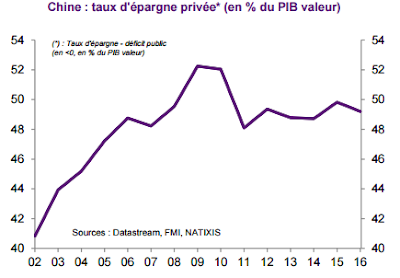
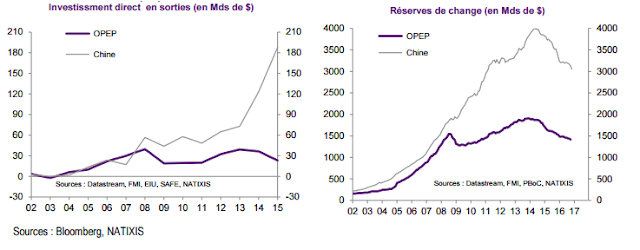

D'où vient la "surabondance d'épargne au niveau mondial" ([global saving glut](https://www.federalreserve.gov/boarddocs/speeches/2005/200503102/)) ? En partie de l'économie chinoise que nous allons brièvement analyser ici. Avant de rentrer dans le vif du sujet, il peut être utile de rappeler que la balance commerciale (export − import) s'égalise au différentiel d'épargne et d'investissement :

**Balance commerciale = Épargne − Investissement**

Un pays qui a une épargne plus importante que son investissement a obligatoirement une balance commerciale excédentaire. C'est le cas de la Chine, d'une grande partie des pays d'Asie de l'Est et de l'Allemagne. À l'inverse dans le cas où l'investissement est supérieur à l'épargne, la balance commerciale est déficitaire, c'est le cas de la France, d'une grande partie des pays européens et des États-Unis.

Remarquons tout d'abord que la relation précédente ne nous indique rien sur le sens de la causalité. Dans certains cas c'est la balance commerciale qui affecte le déséquilibre entre épargne et investissement et dans d'autres cas c'est l'inverse.

En ce qui concerne l'économie chinoise, la causalité initiale semble aller des exportations vers l'épargne.

Au terme d'une succession de réformes débutées en 1978, la Chine a réussi à industrialiser plusieurs zones spécifiques, dont de grandes villes côtières. La hausse des salaires, qui accompagne l'industrialisation, a cependant été limitée par le flux constant de nouveaux arrivants. En effet comme dans tout pays en développement il y avait un surplus de travail important dans le secteur agricole (chômage déguisé), qui en se déversant dans les villes a contenu la hausse des coûts salariaux.

Ainsi les salaires ont progressé moins vite que les gains de productivité entraînant une hausse de la profitabilité du secteur, permettant progressivement plus d'investissements (conformément à la théorie de Lewis (1954), voir [Das et N'Diaye (2013)](http://dragon-report.com/Dragon_Report/Challenges_files/wp1326.pdf) pour une discussion).

La Chine a aussi joué sur son taux de change pour renforcer sa compétitivité avec une sous-évaluation très claire sur la période 1984–2003.

Le dynamisme du secteur industriel a eu des retombées dans les services enclenchant un développement local de plus en plus fort. Or la croissance des revenus entraîne mécaniquement une croissance des montants épargnés. Si l'on rajoute à cela que la politique de l'enfant unique a eu pour conséquence qu'un seul enfant supporte la charge financière de ses deux parents (en 2005, 50% des revenus des personnes de plus de 60 ans provenaient de la famille, d'après [Choukhmane, Coeurdacier et Jin (2014)](http://voxeu.org/article/china-s-one-child-policy-and-saving-puzzle)), on comprend mieux les comportements d'épargne en Chine qui ont été (et sont toujours) excessifs par rapport aux autres nations (l'épargne représente environ 50% du revenu national).

{#fig-epargne}

Notons de plus qu'outre l'émergence d'une classe moyenne, les très hauts revenus ont explosé en Chine. La part des revenus détenus par les 1% les plus riches a ainsi augmenté [de 120% entre 1986 et 2003](http://piketty.pse.ens.fr/fichiers/public/PikettyQian2009_AEJPP.pdf).

Cependant, en raison du sous-développement du secteur financier (et d'un désir de diversification des portefeuilles), les gestionnaires de ces capitaux ont cherché des débouchés à l'international, les États-Unis et l'Europe ont été les principaux bénéficiaires. La crise de 2008 a freiné momentanément ces flux, mais les investissements sont repartis à la hausse depuis. Le seul changement notable concerne le fait que ces excédents extérieurs (qui étaient investis en titres publics au travers des réserves de change) financent désormais un nombre croissant d'acquisitions d'entreprises.

{#fig-ide}

En 2015, les acquisitions d'entreprises faites en Europe par des entreprises chinoises s'élevaient à 38 Mds de $. Ce changement pourrait avoir des conséquences sur les marchés : alors que les achats d'obligations à l'étranger ont eu tendance à faire baisser les taux d'intérêt à long terme, les acquisitions pourraient faire monter les cours boursiers américains et européens.

La Chine n'est qu'un exemple marquant de cet excès d'épargne (le Japon, les pays de l'OPEP et l'Allemagne ont pour des raisons différentes aussi un excédent) qui s'investit en Europe et aux États-Unis. Aussi, si nous revenons à notre équation précédente, il semble cette fois que la causalité aille de l'investissement vers la balance commerciale.

Pour caricaturer, si les pays développés (notamment les USA) importent plus qu'ils n'exportent, cela n'a rien à voir avec la faiblesse des exports, mais avec l'importance des importations, causée par une forte consommation et un fort investissement, eux-mêmes rendus possibles grâce à des taux d'intérêt faibles causés par cette excessive épargne.

La solution n'est pas évidente : les chinois épargnent énormément parce qu'ils ne disposent pas d'un système de retraite digne de ce nom. Une réforme fiscale d'envergure visant à financer une couverture des risques pourrait améliorer cette situation. La récente diminution du poids des exportations dans le PIB chinois (voir [Gaulier, Zignago et Steingress, 2017](https://blocnotesdeleco.banque-france.fr/billet-de-blog/normalisation-du-commerce-mondial-et-chine)) est peut-être une indication d'un changement.
