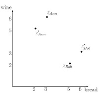
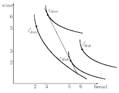
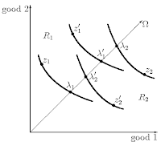

Comme le soulignait R. Kennedy *"Gross National Product measures everything, in short, except that which makes life worthwhile".*

Quel serait donc un bon indicateur de bien être?

La comission [Sen-Stiglitz-Fitoussi](http://www.stiglitz-sen-fitoussi.fr/fr/index.htm) remet aujourd'hui son rapport sur "la mesure de la performance économique et du progrès social", ce qui me donne l'occasion de faire un post sur un indicateur allant au delà du PIB: l'équivalent égalitaire aussi dénommé revenu équivalent. Pour mettre en perspective cet indicateur et pour aborder le sujet d'une façon large, je débuterai par un rappel du théorème d'impossibilité d'Arrow avant d'en venir à une présentation concrète.

## Théorème d'impossibilité d'Arrow

Puisque le PIB ne prend pas en compte nos préférences, qu'il est simplement un indicateur du niveau de production, la question qui se pose est de savoir comment nous pourrions justement aller au delà en agrégeant nos préférences ou notre degré de satisfaction pour construire un indicateur plus intéressant. Arrow se pose donc la question de savoir s'il est justement possible de construire un tel indicateur. Si ces questionnements ne vous intéressent pas (c'est dommage), vous pouvez passer directement à la section sur l'empirique.

Le problème énoncé par Arrow est le suivant, si l'on s'intéresse à

- une population finie N={1,...,n} d'individus rationnels (rationalité = choix cohérents : les préférences sont transitives et réflexives).
- un ensemble d'états sociaux (de situations) X
- un domaine D représentant le profil de préférences de la population analysée sur ces états sociaux RN=(R₁,...,Rn),

existe t-il une fonction f qui pour chaque profil RN définisse une préférence f(RN) sur X compte tenu des axiomes (conditions) suivants:

1. Le domaine D doit être universel, le choix social doit tenir compte de la diversité des choix individuels, il ne doit en exclure aucun.
2. La règle de choix social (la fonction f) doit vérifier l'axiome de rationalité (la préférence f(RN) doit être un préordre sur la totalité de l'ensemble X)
3. La règle d'agrégation (la fonction f) doit vérifier l'axiome faible de Pareto. Si tous les individus ont une préférence stricte unanime alors cette préférence doit être choisie par la société.
4. La règle d'agrégation doit être indépendante des alternatives non pertinentes. En d'autres termes, le classement de deux alternatives ne doit tenir compte que des préférences individuelles sur ces deux alternatives.
5. La règle d'agrégation ne doit pas être dictatoriale (version faible de l'anonymat). La préférence stricte d'un individu ne peut pas être imposée à la société.

Et la réponse est… non, une telle règle n'existe pas, d'où le théorème d'impossibilité : *Toute règle d'agrégation vérifiant les axiomes 1, 2, 3 et 4 est dictatoriale. Toute règle démocratique viole au moins un des axiomes 1, 2, 3, 4.*

Le problème énoncé par Arrow est très général, il peut être restreint aux préférences des individus portant sur les choix politiques (théorie des élections), ou encore sur la gestion d'un club (économie publique). Enfin la population concernée n'est pas obligatoirement composée d'individu, elle peut aussi représenter un ensemble de critères (théorie multi-critères). Ce théorème est assez dévastateur pour aller au delà du PIB puisqu'il indique qu'il est impossible de construire un indicateur de bien-être qui respecte les préférences des agents sous les conditions énoncées.

## Des solutions?

Il est possible de sortir de l'impossibilité en considérant un domaine de profils suffisamment restreint, c'est-à-dire en affaiblissant la condition de domaine universel (e.g. Black, 1948), mais du coup le champ d'analyse est limité.

Enlever l'axiome de Pareto faible résout le problème, mais cette règle est nécessaire dans le paradigme de l'individualisme méthodologique dans la mesure où elle rend le choix social dépendant des choix individuels. Comme le notent Fleurbaey et Hammond (2004, sect. 3) la condition de Pareto permet de se prémunir du paternalisme et du perfectionnisme.

Enfin la non-dictature semble nécessaire... Que reste t-il?

*Comparaison inter-personnelle et rationalité collective*

L'une des solutions pour sortir de l'impossibilité est de permettre des comparaisons interpersonnelles d'*utilité*.

Suite aux travaux de Sen (1970) certains auteurs ont ainsi intégré d'autres variables telles que la santé, l'éducation et ont mené ces comparaisons. On sort alors de l'approche ordinale (voir Sen (1999) pour un survey).

Nombre d'économistes considèrent ces comparaisons interpersonnelles comme la seule solution permettant de sortir de l'impossibilité. Or comme beaucoup d'entre eux refusent d'abandonner la vision ordinale, ils considèrent que le problème d'Arrow reste entier. Ce constat conduit, à tort, une partie de la profession à en rester aux optima de Pareto. Ceci est notamment vrai en éco inter, où **les analyses de bien-être sont trop sommaires** (pour aller plus loin voir par exemple notre [article](http://papers.ssrn.com/sol3/papers.cfm?abstract_id=1393302)). Mais l'approche parétienne est insuffisante lorsqu'il existe plusieurs optima ou lorsque aucune réforme n'est Pareto optimale (de plus juger de l'efficacité d'une réforme sur le seul fait qu'elle est unanimement acceptée revient en fait à ne pas se poser de question sur cette réforme).

On peut aussi modifier le problème en limitant la rationalité collective qui est très exigeante chez Arrow en raison de la transitivité et de la complétude imposées à la règle de décision.

*Théorie de l'équité*

Enfin, la théorie de l'équité permet de sortir de l'impossibilité en considérant qu'il est inutile de réaliser un classement fin de toutes les alternatives sur X. Suivant Fleurbaey (2000):

> *"la théorie de l'équité vise à définir des "règles d'allocation" qui sélectionnent un sous-ensemble des allocations réalisables, dans divers contextes économiques [...] Plus fondamentalement, il faut noter qu'une règle d'allocation définit bien un préordre, même si ce préordre ne contient que deux classes d'indifférence: les allocations sélectionnées, et les autres. Par conséquent, du point de vue strictement formel, il n'y a pas véritablement de modification du problème.[...] Si la théorie de l'équité obtient tant de résultats positifs, c'est donc obligatoirement parce qu'elle abandonne ou affaiblit certains axiomes [...] Par conséquent, le fait essentiel pour la théorie de l'équité est qu'elle renonce implicitement à l'axiome d'indépendance. C'est cela qui marque sa véritable différence avec la théorie du choix social, et non l'abandon apparent de la notion de préordre."*

## Le revenu équivalent, un peu de théorie

Revenons sur l'hypothèse d'indépendance des alternatives non pertinentes. Cet axiome est très restrictif, illustrons ceci à travers un exemple emprunté à Fleurbaey et Maniquet (2008). Soit deux agents Anne et Bob qui se partagent deux biens, du vin et du pain. Nous désirons comparer deux allocations z et z' illustrées par le graphique suivant.

{#fig-alloc}

L'axiome des alternatives non pertinentes est trop restrictif car dans ce cas les allocations sont symétriques et on ne peut donc pas conclure en regardant uniquement ces deux alternatives (z ou z' c'est du pareil au même si on veut être impartial envers Bob et Anne). Pour sortir de l'indécision, il nous manque de l'information concernant les préférences des deux consommateurs. Rajoutons un peu d'info, imaginons que l'allocation z soit un équilibre walrassien à budget égaux. Dans un tel cas les TMS sont égaux, et personne ne désire bouger de cet équilibre qui est Pareto optimal. La situation est très différente pour l'allocation z' où Anne envie le panier de Bob (qui lui préfère sa situation à celle d'Anne). Dans un tel cas le choix social est plus facile à faire, il semble raisonnable de préférer l'allocation z.

{#fig-walras}

Fleurbaey, Suzumura et Tadenuma (2005) ont ainsi pris en compte une information plus précise sur les préférences. Ils ont opéré trois extensions:

1. prise en compte des TMS. cette information très locale (variations infinitésimale le long des courbes d'inf aux alentours des allocations) est suffisante pour construire une règle d'agrégation non dictatoriale, mais l'anonymat n'est cependant pas respecté.
2. prise en compte des courbes d'inf dans la boîte d'Edgeworth. L'impossibilité d'Arrow persiste.
3. prise en compte d'une partie de la courbe d'indifférence allant de la situation actuelle de l'agent jusqu'à un rayon particulier dans l'espace des biens. Cette dernière extension permet de construire une règle d'agrégation.

Illustrons cette solution pour Anne (numéro 1) et Bob (numéro 2). Le rayon particulier part de l'origine des axes et est dirigé vers la dotation globale de l'économie (omega sur la Figure ci-dessous). Il suffit alors de connaître une partie de la courbe d'indifférence comprise entre la situation de l'agent et ce rayon. En d'autres termes, on pose à Anne et à Bob la question suivante: quelle est la part des dotations globales qui laisserait votre satisfaction inchangée. On obtient ainsi les lambda1 et lambda2 et les lambda'1 et lambda'2 (voir Figure). Il suffit ensuite de les additionner pour comparer les deux allocations.

{#fig-lambda}

Il est important de noter que l'évaluation lambda1+lambda2 et lambda'1+lambda'2 n'a pas de valeur en soi, ce qui compte c'est simplement le classement lambda1+lambda2 > lambda'1+lambda'2. L'impossibilité d'Arrow a été levée tout en évitant les comparaisons interpersonnelles.

Remarque: si les hommes politiques veulent prendre des décisions sociales justes ils doivent avoir une certaine information sur les préférences des citoyens. De ce point de vue les sondages d'opinion ne sont pas forcément une mauvaise chose. Ils pourraient être intéressants si les questions posées suivaient le principe du revenu équivalent.

## Le revenu équivalent, un peu d'empirique

Fleurbaey et Gaulier (2009) proposent de construire un indicateur du niveau de vie en se basant sur la théorie énoncée plus haut. Les auteurs partent du PIB par tête, puis calculent plusieurs corrections à ce revenu qui permettraient aux individus (aux populations plus précisément) d'atteindre une norme dans chacune des dimensions suivantes:

1. Revenu national par tête
2. Temps de travail
3. Précarité, risque de chômage
4. Espérance de vie en bonne santé
5. Taille des foyers
6. Inégalités
7. Soutenabilité (analysée via consommation de capital physique et naturel, dont les émissions de gaz à effets de serre)

Au final les auteurs obtiennent un indicateur, le revenu équivalent (aux solides fondements théoriques) qui mesure non seulement le bien-être monétaire mais aussi le bien-être non monétaire. Sans surprise, le classement des pays est très différent de celui que l'on obtient avec le PIB.

Les Etats-Unis passent ainsi de la troisième place à la 6ème place en prenant en compte la santé, idem avec les inégalités et chutent à la dixième place avec intégration de la soutenabilité. La France à l'inverse progresse dans le classement, ce qui nous indique que nous n'avons peut-être pas grand chose à envier au modèle américain.

Pour conclure, s'en tenir au PIB c'est considérer que la production est une fin en soi, or un bon niveau de santé, une faible précarité, des inégalités réduites et de bonnes perspectives de soutenabilité sont des éléments tout aussi importants (pour ne pas dire plus).

## Note

²Evidemment l'équivalent égalitaire n'est pas la seule piste de recherche pour aller au delà du PIB (voir Fleurbaey 2009 pour un survey)

## Bibliographie

- Arrow K. J. 1951, Social choice and individual values, Wiley.
- Candau, F., Fleurbaey, M. Agglomeration and Welfare with Heterogeneous Preferences. *Open Econ Rev* 22, 685–708 (2011). [DOI](https://doi.org/10.1007/s11079-010-9168-y)
- Fleurbaey, M., 2000, Choix social: une difficulté et de multiples possibilités'', Revue Economique 51: 1215-1232.
- Fleurbaey, M., 2009, Beyond GDP: The quest for a measure of social welfare, Journal of Economic Literature.
- Fleurbaey, M., Gaulier, G. International comparisons of living standards by equivalent incomes, Scandinavian Journal of Economics.
- Fleurbaey M., Hammond P. (2004), Interpersonally comparable utility, in S. Barbera, P. Hammond, C. Seidl eds., Handbook of Utility Theory, vol. 2, Kluwer.
- Fleurbaey, M., Maniquet F., 2008, Fair social orderings, Economic Theory 34 : 25–45.
- Fleurbaey, M., Suzumura K., Tadenuma K., 2005, Arrovian aggregation in economic environments: How much should we know about indifference surfaces?, Journal of Economic Theory 124 : 22-44.
- Sen A.K. 1999, "The possibility of social choice," American Economic Review 89: 349-378.
