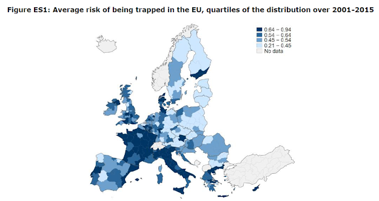

I have just finished to read this [report](https://ec.europa.eu/regional_policy/en/information/publications/studies/2020/falling-into-the-middle-income-trap-a-study-on-the-risks-for-eu-regions-to-be-caught-in-a-middle-income-trap) about "Falling into the Middle-Income Trap? A Study on the Risks for EU Regions to be Caught in a Middle-Income Trap" written by Simona Iammarino, Andrés Rodríguez-Pose, Michael Storper and Andreas Diemer.

There are many things interesting inside. By borrowing the concept of "middle-income trap" used in international economics and by applying it to region, they offer a general overview of the spatial economy in Europe.

More precisely they distinguish three different types of trapped regions (p.3-4):

1. *"Regions trapped at high levels of income: These are territories that, despite still being relatively well-off in terms of GDP per capita, have experienced long periods of subpar economic, productivity, and employment growth, often associated with the demise of industries that were their main source of wealth in the past. This group includes most regions in Central and North Eastern France, Northern and Central Italy, Northern Jutland in Denmark, South Sweden, Southern Finland, and Lower Austria. These regions have experienced significant relative economic decline, bringing many of them closer to middle-income levels in the EU.*
2. *Regions trapped at middle-income levels: These are regions that had achieved, by the late 1990s, levels of GDP per head that were between 75 and 100 percent of the EU average, but whose economic dynamism has since stagnated. As a consequence, they have struggled to improve their standing, often both in relative and in absolute terms. This group includes regions in the Italian Mezzogiorno, areas of Greece close to Athens and Thessaloniki, Valencia and Murcia in Spain, but also regions that have been declining for a considerable amount of time in Wallonia (Belgium) and Northern England (UK).*
3. *Regions trapped at low levels of income: These are regions that, in contrast to most of the less developed regions in Europe receiving substantial investment from the Cohesion Policy, have struggled to sustain any type of economic dynamism at levels of GDP per capita below 75 percent of the EU average. Regions such as Calabria in Italy, East Macedonia and Thrace, West Greece, Thessaly, or Epirus in Greece, as well as regions in Central and Eastern Europe, such as Adriatic Croatia or Southern Transdanubia in Hungary, belong in this group".*

By looking at their map (see below), it seems that for different reasons, many regions in France and Italy are in a middle income trap!

To analyse the determinants of being trapped, they use a simple estimation in panel data with very standard explanatory variables (innovation, political governance and so on) and fixed effects. This analysis may be biased (endogenous issues), but it is not an academic paper and for a report that has the aim to attract the interest of policy makers at the regional scale, I think it is a worth reading descriptive analysis. This report may be also useful for graduate students interested in urban/regional economics.
