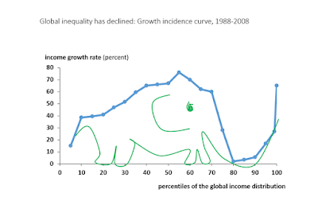

Est-ce la mondialisation qui crée les inégalités ou le progrès technique? Evidemment ce sont les deux, et il est sans doute de plus en plus difficile de les séparer, mais c'est une habitude bien répandue que de chercher LE coupable. Dans les années 90, la mondialisation était considérée comme non coupable (selon les termes même d'un titre de [Paul Krugman](https://www.amazon.fr/Mondialisation-nest-pas-coupable-libre-%C3%A9change/dp/270713113X)). Puis dans les années 2000, les certitudes ont commencé à vaciller, l'entrée de la Chine dans le commerce international a eu des conséquences assez importantes sur le marché du travail. On pouvait ainsi [lire le même Krugman en 2007 sur vox-eu](http://voxeu.org/article/trade-and-inequality-revisited):

> *It's no longer safe to assert that trade's impact on the income distribution in wealthy countries is fairly minor. There's a good case that it is big, and getting bigger. I'm not endorsing protectionism, but free-traders need better answers to the anxieties of globalisation's losers.*

Puis est venu le temps des travaux de David Autor et Gordon Hanson, qui mieux que personne ont quantifié les effets de cette mondialisation aux États-Unis. Vous verrez cependant que dans cette vidéo, ils sont loin de penser que la mondialisation est l'unique cause des inégalités (environ 20% des destructions d'emplois), dans d'autres travaux David Autor a d'ailleurs montré l'importance des progrès techniques pour expliquer la polarisation des emplois aux USA.

<iframe width="320" height="266" src="https://www.youtube.com/embed/oXl3UTcuBJ4" frameborder="0" allowfullscreen></iframe>

Voici enfin cette [revue de littérature d'Helpman (2016)](http://scholar.harvard.edu/files/helpman/files/globalization_and_wage_inequality_120216_final_for_wp.pdf), dont on pourrait extraire ceci: "Globalization has had only **moderate** effects on wage inequality".

On pourrait cependant rétorquer que les inégalités de salaires ne sont pas le problème central, ce sont surtout les inégalités de richesse ou de patrimoine qui sont inquiétantes à l'heure actuelle. En France par exemple, les 10 % les plus riches possèdent la moitié du patrimoine des ménages, les 1 % le sixième. Alors certes, avec Helpman on pourrait considérer que l'évolution du patrimoine n'est pas directement liée à la mondialisation (du moins commerciale), cela dépend énormément du prix du foncier, de la démographie (i.e. concentration de l'héritage du patrimoine) et de la fiscalité (voir cette note sur [une société d'héritiers](http://www.strategie.gouv.fr/sites/strategie.gouv.fr/files/atoms/files/na_51-transmissions-ok.pdf)).

Mais si l'on en reste à la mondialisation commerciale, l'impact de l'ouverture ne peut pas tout expliquer, vous trouverez [ici un intéressant commentaire toujours de Paul Krugman](https://www.gc.cuny.edu/CUNY_GC/media/LISCenter/pkrugman/Trade-and-Manufacturing-Employment.pdf):

> "But what about the now-famous Autor-Dorn-Hanson paper on the "China shock"?  Autor et al only estimate the effects of the, um, China shock, which they suggest led to the loss of 985,000 manufacturing jobs between 1999 and 2011. That's less than a fifth of the absolute loss of manufacturing jobs over that period, and a quite small share of the long-term manufacturing decline.
> 
> I'm not saying that the effects were **trivial**: Autor and co-Authors show that the adverse effects on regional economies were large and long-lasting. But there's no contradiction between that result and the general assertion that America's shift away from manufacturing doesn't have much to do with trade, and even less to do with trade policy."

J'ai surligné trivial, car il est hors de question de dire que la mondialisation n'a pas d'effet sur les inégalités, depuis toujours les économistes disent qu'il y a des travailleurs qui vont être durement touchés par la mondialisation et depuis toujours la question qui est posée est celle de la redistribution. L'impact de l'entrée de la Chine dans le commerce inter a affecté la distribution des revenus dans de nombreux pays (idem en ce qui concerne les accords régionaux tels que l'UE ou le [NAFTA](http://rodrik.typepad.com/dani_rodriks_weblog/2017/01/what-did-nafta-really-do.html)) et les répercussions ont d'ailleurs sans doute été différentes d'un pays à l'autre. D'après cette étude de [Malgouyres (2016)](https://publications.banque-france.fr/sites/default/files/medias/documents/document-de-travail_603_2016.pdf) en France l'effet inégalitaire n'a pas été détecté mais 13% des destructions d'emploi dans le secteur industriel sont dues au choc chinois avec un fort effet multiplicateur dans les services (voir [Martin Anota](http://www.blog-illusio.com/2016/09/quel-est-l-impact-de-la-concurrence-chinoise-sur-l-emploi-et-les-salaires-en-france.html) pour un topo plus long sur cet article). Treize pourcents, c'est énorme, surtout si l'on songe qu'il y a eu d'autres chocs d'ouverture (i.e. l'Allemagne pour la France) mais il reste quand même un gros pourcentage des destructions qui n'est pas lié au commerce (songez que même la [Chine se désindustrialise](http://rodrik.typepad.com/dani_rodriks_weblog/2013/10/on-premature-deindustrialization.html), dans ce cas là il est peut-être plus facile de comprendre que c'est bien la robotisation ainsi qu'une demande de services plus forte qui expliquent le relatif déclin de l'industrie). En ce qui concerne le marché du travail allemand, vous pourrez lire avec intérêt une étude similaire de [Dauth, Findeisen, Suedekum (2014)](https://docs.google.com/viewer?a=v&pid=sites&srcid=ZGVmYXVsdGRvbWFpbnxqZW5zc3VlZGVrdW18Z3g6NjYzNjgzMTZmMTZlOGNiZg) ou [Dauth et Suedekum (2015)](https://docs.google.com/viewer?a=v&pid=sites&srcid=ZGVmYXVsdGRvbWFpbnxqZW5zc3VlZGVrdW18Z3g6ZDQyYTUzYTMwZjRhODUy) avec une dimension plus régionale.

Oh, et si vous pensez que la mondialisation a accouché *à elle seule* d'un éléphant qui a fait beaucoup parlé de lui sur les réseaux récemment...

Figure 1: ça trompe énormément?

... lisez cet article de [Caroline Freund](https://piie.com/blogs/realtime-economic-issues-watch/deconstructing-branko-milanovics-elephant-chart-does-it-show) et cette réponse de [Lakner et Milanovic](http://www.gc.cuny.edu/CUNY_GC/media/CUNY-Graduate-Center/LIS%20Center/elephant_debate-4,-reformatted.pdf) dont la prudence illustre l'intelligence (voir la section "B. Explanation"):

> "We remain open to the possibility that globalization is part of the reason for the low income growth of the Western middle classes. It is unlikely to be an entire explanation; and actually no single factor can be".

Pour conclure, mondialisation et progrès technique sont intimement liés (les nouvelles techniques de communication ont permis de fragmenter l'appareil productif à l'échelle internationale, ont favorisé la mobilité des capitaux, la robotisation a engendré une polarisation des emplois et la mondialisation a abaissé les coûts de fabrication de ces robots etc), et ces deux facteurs sont sources d'inégalités internes et de croissance économique. L'énorme problème est que ces inégalités n'ont pas été corrigées (dans les pays anglo-saxons encore moins qu'ailleurs), elles ont même été relativisées dans les discours ce qui explique en partie la colère légitime des peuples.
