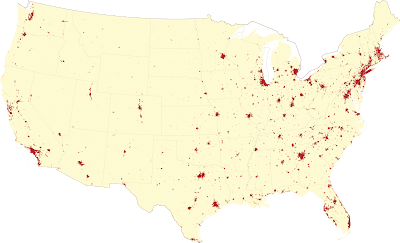
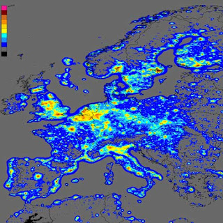
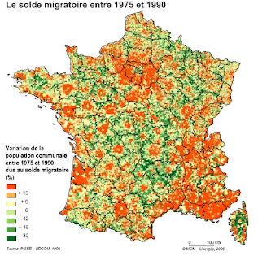
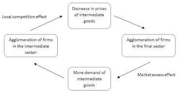
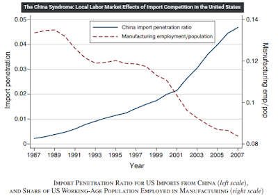
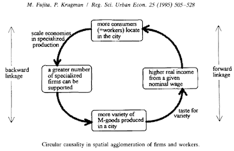
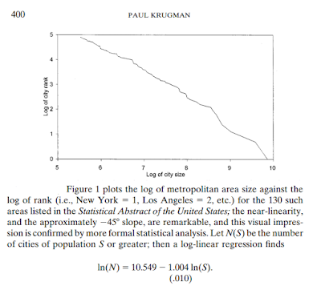

To introduce "its" New Economic Geography, Krugman (1991) starts with facts:

> *One of the most remarkable things about the United States is that [...] the bulk of the population resides in a few clusters of metropolitan areas. [...] Nighttime satellite photos of Europe [] clearly suggest a center-periphery pattern whose hub is somewhere in or near Belgium.*

Here a picture of urban areas in 2010 (in red) in the US...

{#fig-urban}

Not very red...

... and here a picture of light pollution by night in Europe where the [Blue Banana](https://en.wikipedia.org/wiki/Blue_Banana) or Core-Periphery scheme may be observed.

{#fig-light}

People are indeed not evenly distributed across space. Why? Mainly in reason of a trade-off between increasing returns and trade costs according to Krugman (1991). To understand this, think of the industrial revolution which by reducing dramatically trade costs and by fostering increasing returns (and thus wages and/or profits) in cities can explain partially the agglomeration of activities there.

Maybe when you are on a high speed train or when you think about futuristic ideas, like the Hyperloop, you wonder about the possible effects of these innovations on the location choice of people and firms.

## Regional economics

In Krugman (1991), when trade costs are small enough then agglomeration forces dominate the dispersive ones and a virtuous circle of agglomeration occurs. This is the main result of Krugman (1991), let's now discuss the different effects that explain this result:

1) Local competition effect: an increase in the number of entrepreneurs in one region exacerbates local competition among firms. Thus new entry triggers a slump in the price index, and thereby in operating profits, too. So that in order to stay in the market, firms need to remunerate their workers less.

2) Market access effect: as the income generated by new entrepreneurs is spent locally, sales and operating profits increase and under the `zero profit condition' this implies a higher nominal wage.

When the local competition effect is smaller than the market access effect, you get the "home market effect": a country with a share of world demand for a good that is larger than average will obtain a more than proportional share of world production of that good. The HME is still analyzed in international economics, see for instance this [Costinot et al. (2016)](http://economics.mit.edu/files/11796) article (with the interesting title "The More We Die, The More We Sell?"), and also [Behrens et al. (2009)](http://www.sciencedirect.com/science/article/pii/S0022199609000993) and [Crozet and Trionfetti (2008)](http://www.sciencedirect.com/science/article/pii/S0022199608000871) for theoretical discussions and empirical tests.

3) Cost of living effect: goods are cheaper in a large agglomeration because imports are lower (many goods are produced there) and thus the burden of transaction costs too. Hence, the purchasing power of individuals is higher in this location, which attracts people.

This last effect has been less studied than the HME and it is quite dubious: the cost of living is considered by the layman as higher in large cities than in small ones, the reverse seems silly. However varieties consumed in small and large cities are not exactly the same, there is a bias due to the fact that in large cities wealthier households purchase more expensive varieties, a fact that is not in Krugman (1991). [Handbury and Weinstein (2011)](https://core.ac.uk/download/pdf/6363745.pdf) show that once they control for this composition effect, this cost of living effect is not so stupid, prices for the same good are actually lower in larger cities. One can however raise some doubt about its strength in comparison to the higher price of housing in large cities that weigh heavily on the costs of living of individuals. In brief, agglomeration may destroy itself by increasing the cost of living in big cities.

By considering this, Krugman and Livas-Elizondo (1996) introduce urban costs (land rent, commuting) and reverse the result of Krugman (1991): trade integration leads to a dispersion of activities once urban costs are taken into account (see also Helpman, 1998; Murata and Thisse, 2005; Suedekum, 2006; [Candau, 2011](http://web-prod2.univ-pau.fr/gtl/travaux/57F_DocWcattIsAgglomerationDesirable-1.pdf)).

Different authors have unified these two results, finding a process of dispersion-agglomeration-dispersion due to trade integration i.e. a [rise and fall of regional inequality](http://eprints.lse.ac.uk/20643/1/The_Rise_and_Fall_of_Regional_Inequalities.pdf) (Puga, 1998; Tabuchi, 1998). This bell shaped relationship between trade integration and agglomeration is certainly one of the main results of the NEG.

In France, [Combes et al. (2008)](https://hal-pjse.archives-ouvertes.fr/halshs-00586214/document) find evidence of this concerning manufacturing and services that experienced bell-shaped spatial development curves, the agglomeration process reaching maxima around 1930. Kim (1998) has found the same result for the U.S. manufacturing industries, observing a dispersion tendency since 1950. At the European level, Brulhart and Traeger (2005) have observed a dispersion of activities at the national level and agglomeration at the regional one.

This is also a well verified fact in France, where the Core-Periphery pattern, considered by Gravier (1947) as "Paris and the French desert" has known a strong process of dispersion. Paris has lost activities and people relative to Marseille, Lyon, Lille and many other large cities. In contrast, at the regional level, agglomeration has been the rule, these cities attracting activities from their immediate proximity. To illustrate this simply, just look this old "leopard" map of France (in red positive change of the population between 1975 and 1990, in green negative change). Obviously many other things can be said about this map, e.g. urban sprawl, but this is another story.

{#fig-leopard}

## International economics

Krugman (1991) is a model belonging to the field of the regional economics because individuals working in the increasing returns sector can move from one region to another making wages endogenous to location choices. This regional mobility of the labour force was not a feature of models developed in international economics, economists in that field were simply not interested in the local consequences of globalization such as the geographical change of activities inside a country (except Ohlin maybe).

Economists on international economics in the 90s were increasingly interested in trade of intermediate goods, this trade representing a growing part of international trade. Thus when Venables (1996) and [Krugman and Venables (1995)](http://www.ifn.se/wfiles/wp/wp430.pdf) propose a new version of Krugman (1991) with international trade of intermediate goods, the NEG takes a new dimension. The virtuous circle explaining agglomeration with this model is quite realistic. The agglomeration of firms producing intermediate goods leads to more competition implying a decrease of price that makes firms of the final goods more competitive, increasing their demand in local intermediate goods to save trade costs which fosters more agglomeration of firms in the intermediate sector and so on.

{#fig-kv95}

In this model, as in Krugman (1991), trade integration leads to a core-periphery pattern but this time at the international level. Interestingly, trade integration first leads to a divergence of income, and then when trade costs decrease even more, to convergence: the periphery gains in terms of real incomes, while the core nation can be a loser of this deeper integration. Gordon Hanson, a former Ph-D student of Paul Krugman, is certainly one of the authors of the NEG that has surpassed the master on this topic, with its analysis on the [detrimental effect of trade with China on the U.S. economy](http://economics.mit.edu/files/11602) in a series of articles co-written with David Autor and David Dorn.

{#fig-adh}

## Urban economics

Finally Krugman (1991) becomes urban with Fujita and Krugman (1995) from which the following Figure is borrowed.

{#fig-circular}

The virtuous circle is exactly the same as in Krugman (1991) but now used to analyze a typical topic of urban economics, the emergence of an urban system. This first paper is mainly on the conditions of agglomeration in a single city, but [Krugman (1996) already questions the size distribution of cities in the United States](http://www.elitovar.net/wp-content/uploads/2014/08/1996_JPIE_KRugman_MysteryHierarchicalCities.pdf) which follows "a simpler power law: the number of cities whose population exceeds S is proportional to 1/S".

{#fig-ranksize}

Finally [Fujita, Krugman and Mori (1999) analyze the evolution of hierarchical urban systems](http://www.sciencedirect.com/science/article/pii/S001429219800066X).

However, the low hanging fruits of the NEG seems to have been picked in the regional/international fields. For instance regarding the city size distribution, Gabaix and Ioannides (2004) wrote "*Models of the new economic geography (Fujita et al. (1999)) in their pure forms fail the task of predicting a Zipf's law, and in fact not even a power law*". In fact the NEG has known only recently a real success in urban economics (more on this in the next post).

At the end of the twentieth century, the triumph of the NEG was however clear, Krugman and his co-authors have propelled the NEG in the AER, QJE, JPE and some empirical applications of the NEG have found similar success; such as Ades and Glaeser (1995) finding that trade liberalization does not impact the size of urban primacy (once endogeneity is treated), Davies and Weinstein (1999, 2003) finding that agglomeration may be a stable equilibrium despite violent shocks, Hanson (1998) analyzing the US local labor market and its regional integration and so on.

A new generation of researchers led by Anthony Venables, Richard Baldwin and Jacques-François Thisse were ready to extend the NEG to various domains. We are going to survey this new wave in the next post from the the NEG applied to public policies and to quantitative models that have been recently developed.

As a soundtrack: Arcade Fire (Krugman is a fan) with the song "Ready to start".

<iframe allowfullscreen="" class="YOUTUBE-iframe-video" data-thumbnail-src="https://i.ytimg.com/vi/9oI27uSzxNQ/0.jpg" frameborder="0" height="266" src="https://www.youtube.com/embed/9oI27uSzxNQ?feature=player_embedded" width="320"></iframe>

In the lyrics you can hear:

***All the kids have always known***

***That the emperor wears no clothes***

{width=320}

This is a good transition for what is following (maybe in two weeks): the kids of the second wave of the NEG, their disillusion and their success.

F. Candau

To learn more on the NEG:

[The Spatial Economy](https://mitpress.mit.edu/books/spatial-economy) 
Cities, Regions, and International Trade 
By Masahisa Fujita, Paul Krugman and Anthony J. Venables

[Economics of Agglomeration: Cities, Industrial Location, and Regional Growth](http://www.cambridge.org/fr/academic/subjects/economics/microeconomics/economics-agglomeration-cities-industrial-location-and-globalization-2nd-edition?format=HB&isbn=9781107001411) 
by Masahisa Fujita and Jacques-Francois Thisse

[Economic Geography and Public Policy](http://press.princeton.edu/titles/7524.html) 
Richard Baldwin, Rikard Forslid, Philippe Martin, Gianmarco Ottaviano, & Frederic Robert-Nicoud

[Economic Geography: The Integration of Regions and Nations](http://press.princeton.edu/titles/8765.html) 
by Pierre-Philippe Combes, Thierry Mayer & Jacques-François Thisse

There are also many interesting surveys, see in particular [Neary (2001)](http://researchrepository.ucd.ie/bitstream/handle/10197/1315/WP00.19.pdf?...1), [Behrens and Robert-Nicoud](http://joeg.oxfordjournals.org/content/11/2/215.short) and maybe [Candau (2008)](http://onlinelibrary.wiley.com/doi/10.1111/j.1467-6419.2008.00553.x/abstract).

## References (incomplete)

- Davis D. and Weinstein, D., 2002. Bones, Bombs, and Break Points: The Geography of Economic Activity, American Economic Review 92: 1269-1289.
- [Candau](https://ideas.repec.org/a/adr/anecst/y2011i101-102p203-227.html), [2011, Is agglomeration Desirable? Annals of Economics and Statistics. Vol 101/102, 203-229](http://web-prod2.univ-pau.fr/gtl/travaux/57F_DocWcattIsAgglomerationDesirable-1.pdf).
- [Candau F, 2008. Entrepreneurs' Location Choice and Public Policies, a Survey of the New Economic Geography. Journal of Economic Surveys. Vol. 22, Issue 5, pp. 909-952.](https://ideas.repec.org/a/bla/jecsur/v22y2008i5p909-952.html)
- Hanson, G. H. (2001) U.S.-Mexico Integration and Regional Economies: Evidence from Border-City Pairs, Journal of Urban Economics 50: 259-287.
- Hanson, G. H. (2005) Market Potential, Increasing Returns, and Geographic Concentration. Journal of International Economics 67: 1-24.
- Helpman, H. (1998) The Size of Region, In D. Pines, E. Sadka, and I. Zildcha (eds.). Topic in public economics. Theorical and Applied Analysis. Cambridge: Cambridge University Press, 33-54.
- Krugman, P. (1991) Increasing Returns and Economic Geography. Journal of Political Economy 99: 483-499.
- Krugman, P. and Livas, R. (1996) Trade policy and the third world metropolis. Journal of development Economics 49: 137-150.
- Krugman P and Venables AJ (1995) Globalization and the inequality of nations. Quarterly Journal of Economics 110: 857-880
- Murata Y and Thisse J-F (2005) A simple model of economic geography à la Helpman-Tabuchi. Journal of Urban Economics 58: 137-155.
- Puga, D. (1999) Rise and fall of regional inequalities. European Economic Review 43: 303-334.
- Sudekum J., (2006). Agglomeration and Regional Costs-of-Living, Journal of Regional Science 46, p 529-543.
- Sudekum J., (2008). Regional Costs-of-Living with Congestion and Amenity Differences - An Economic Geography Perspective, Annals of Regional Science.
- Tabuchi, T. (1998) Urban agglomeration and dispersion: a synthesis of Alonso and Krugman, Journal of Urban Economics 44: 333-351.
- Venables, AJ. (1996) Equilibrium locations of vertically linked industries. International Economic Review 37: 341-359.
