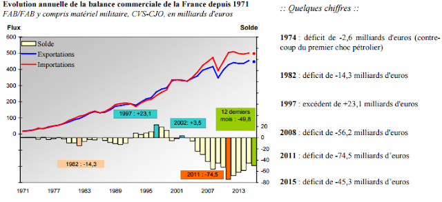
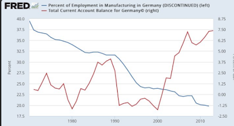

Le déficit commercial est un sujet qui revient sans cesse et qui inquiète nos politiques. Aux USA, le débat a été lancé initiallement par la nomination de Peter Navarro à la tête du National Trade Council et de ses [déclarations alarmistes](https://www.bloomberg.com/view/articles/2016-12-28/trump-s-trade-chief-peter-navarro-makes-a-rookie-mistake) concernant le déficit commercial américain. Ce sujet est ensuite devenu la marotte préférée du président Donald Trump.

En France, ces commentaires ont été moins nombreux depuis le pic de -74,2 Md€ atteint en 2011, et la récente baisse du déficit, mais des déclarations similaires ont très souvent été faites (et le seront à nouveau dans le futur).

{#fig-deficit}

Pour [F. Bayrou](http://www.liberation.fr/france/2012/02/25/deficit-commercial-et-emploi-l-equation-trop-parfaite-de-bayrou_798634), le déficit commercial, c'était le "problème central":

> "lorsque un pays s'appauvrit tous les mois, les emplois s'en vont. Soixante-dix milliards, c'est l'équivalent de la totalité du salaire annuel, avec les charges, de plus de 2 millions de salariés. Comme on a 2,5 millions de chômeurs à temps plein… Il ne faut pas chercher plus loin les raisons".

Pour le [FN](http://www.frontnational.com/2015/12/deficit-commercial-la-politique-economique-du-gouvernement-va-de-mal-en-pis/), même combat:

> "Cette dégradation catastrophique de la balance commerciale française est une calamité pour l'économie. Elle est nourrie en effet par la consommation des ménages, seule variable économique encore dans le vert, qui profite donc à plein à l'emploi étranger au détriment de l'emploi français. Ce sont les importations qui sont stimulées, et non la production nationale."

et ainsi de suite, vous trouverez les mêmes points de vue à gauche, droite et extrême gauche. Ces politiques expriment d'ailleurs sans doute ce qu'une partie de la population pensent; face à la concurrence internationale de pays à bas salaires, nos industries ne peuvent pas être compétitives. La mondialisation est à la base d'une désindustrialisation et d'une perte de compétitivité. Mais le déficit commercial est-il la preuve de cette perte de compétitivité? Et surtout, est-ce grave et désire t-on à tout prix un excédent commercial?

Précisons tout d'abord une égalité comptable: une balance commerciale déficitaire est avant tout l'indication qu'un pays épargne moins qu'il n'investit. De cette égalité, on peut rapidement déduire qu'une des façons simples (souvent utilisée et pourtant contreproductive) pour réduire les déficits, est de réduire les investissements des entreprises, des ménages et de l'Etat. C'est précisément ce qu'il s'est passé dans les nombreux pays qui ont subi des politiques d'austérité et d'ajustement (l'Espagne, le Portugal, etc.). Ces pays sont aujourd'hui présentés comme des exemples en termes de compétitivité et de performance à l'export, mais c'est oublier que l'on croit toujours plus vite lorsqu'on part de très bas.

En effet, la baisse généralisée de l'investissement, et donc de la demande de biens et de services, se traduit par du chômage et, à terme, par une baisse des salaires (et une hausse de l'épargne de précaution) qui rend l'économie plus compétitive et améliore ainsi la balance commerciale. C'est le choix réalisé par l'Allemagne et sa politique de modération salariale et de fragmentation internationale de son appareil productif. Voir [Thomas Piketty](https://www.lemonde.fr/blog/piketty/2017/01/05/de-la-productivite-en-france-en-allemagne-et-ailleurs/) pour une comparaison France/Allemagne plus approfondie.

La situation allemande est intéressante, dans la mesure où l'excédent commercial est souvent vu comme l'exemple d'une industrie forte et conquérante. Vous remarquerez pourtant, sur le graphique ci-dessous, que l'Allemagne subit tout de même une désindustrialisation marquée et une perte de ses emplois industriels. Enfin, si la spécialisation industrielle de l'Allemagne sur l'automobile, est depuis longtemps un atout, elle pourrait bien être une faiblesse dans l'avenir comme nous l'enseigne l'exemple de Détroit.

{#fig-fred}

En clair le solde de la balance commerciale n'est pas la bonne boussole qui nous permettrait de savoir si le pays avance, ou pas, dans la bonne direction. La désindustrialisation, par contre, est un sujet bien plus important et aussi plus complexe.

Précisons deux faits, tout d'abord l'industrie et la ré-industrialisation sont des éléments essentiels dans nos économies tertiaires et vieillissantes. Assurer la production de biens et services médicaux dans le secteur de la santé est par exemple un enjeu essentiel pour éviter les manques d'approvisionnement, et progressivement les pertes de savoir-faire industriel dans la production de biens essentiels aux populations.

Le secteur de la défense revêt un caractère similaire de protection des populations qui ne peut admettre une désindustrialisation et donc une dépendance de sa production, nécessairement industrielle.

D'autre part, l'industrie moderne se caractérise par deux éléments, l'un positif: les salaires y sont plus élevés que dans les secteurs des services, l'autre plus négatif: elle est très intensive en capital physique, c'est à dire en robot et automatisation. Son expansion n'est donc pas synonyme d'une croissance économique globale.

Le fait que l'industrie soit intensive en capital, implique qu'elle fonctionne sous rendements croissants, la production coûte d'autant moins qu'elle est réalisée à grande échelle. En conséquence, pour qu'une industrie soit rentable, elle doit se développer sur plusieurs marchés. Mais cet objectif bute sur deux problèmes essentiels, le monde est de plus en plus protectionniste, et les coûts fixes de production industrielle ont déjà été payés dans de nombreux pays (e.g. USA, Allemagne, Chine), ce qui rend l'entrée sur ces marchés difficile.

Dans ces conditions, l'inaction des politiques, souvent décriées, est compréhensible, il est difficile pour un gouvernement d'être cet "Etat stratège" qui saurait faire le tri entre les industries en déclin, qui constitue une dépense publique vaine, et les industries de demain qui assureront des hauts salaires et des emplois.

Que reste-t-il? On peut en appeler au "patriotisme" du citoyen à consommer français.

Le problème de ce bon sentiment est d'opposer de façon systématique la production et les importations, comme s'il y avait une substitution parfaite entre les biens produits en France et les biens importés, et de plus, que cette consommation de "made in France" industriel n'aurait aucune conséquence sur les autres secteurs français.

Alors, oui, il y a du vrai dans cette idée qui est à la base de tous les discours politiques. Il est possible que lorsque vous achetez des sous-vêtements produits ailleurs, vous n'achetiez pas de sous-vêtement français.

Ceci dit, sans jeu de mots, vu le prix de ces biens, il faut être bien sûr que si vous les achetez, vous ne renoncerez pas à un restau pour compenser, car dans ce cas, pas sûr que le bilan soit positif en termes d'emploi.

Il y a quelques années, [Charlotte Emlinger et Lionel Fontagné](http://www.cepii.fr/CEPII/fr/publications/lettre/abstract.asp?NoDoc=5958) avaient évalué que les biens importés représentaient un gain pour le pouvoir d'achat des consommateurs allant de 100 à 300 euros par mois, ils concluaient cette étude par ce commentaire toujours d'actualité:

> "La substitution de produits nationaux aux produits importés augmenterait la dépense sur les produits concernés, ce qui réduirait la consommation de services. Or il est tout à fait possible que le contenu en emplois des services, par euro de valeur ajoutée, soit plus important que celui des usines robotisées fabriquant les substituts aux biens importés".

Voir aussi cet article de [Blaum et al (2016)](http://cepr.org/active/publications/discussion_papers/dp.php?dpno=11721) qui montre que sans les importations de biens intermédiaires le prix des biens industriels français augmenteraient de 27%.

Alors consommer plus cher "pour la France", pourquoi pas, mais dans ce cas je propose un "France-Job-Score" qui nous indique sur chaque produit le contenu en emploi français de sorte à ce que le consommateur puisse consommer de façon un peu plus éclairée.

Enfin, pour revenir au sujet initial de la compétitivité, le [management](http://cep.lse.ac.uk/pubs/download/occasional/op041.pdf) qui explique ou évite les burn-out, la vie dans l'entreprise qui joue sur la motivation au travail, les RH qui assurent le suivi et la formation des employés, la connaissance des marchés (e.g. maîtrise des langues, des cultures, des réglementations et de la concurrence), l'investissement (en nouvelles technologies évidemment, mais aussi en maintenance) sont autant d'éléments qui comptent pour améliorer la productivité globale des facteurs et pour gagner des parts de marché.

Cette conclusion est tout aussi banale qu'importante, les études sur les sources de croissance économique avancent déjà depuis des décennies qu'une partie non négligeable des gains de productivité proviennent de ce type d'éléments qui améliorent les capacités de production et d'exportation.

Si l'on adopte une perspective de long terme il est même possible d'aborder le problème du coût du travail et de la compétitivité d'une façon différente comme le font Bas et al (2015) qui discutent du marché immobilier en ces termes:

> "Il faut souligner que l'ensemble de l'économie française participe à la construction de la compétitivité prix. Améliorer le fonctionnement du marché du logement, par exemple, contribue à la compétitivité dans la mesure où la hausse des loyers et de l'immobilier pèse sur le budget des ménages et conduit à terme à des hausses de salaires".

Evidemment espérons que nous n'ayons pas besoin d'un argument de compétitivité pour améliorer le fonctionnement du marché immobilier.
