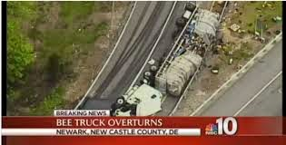
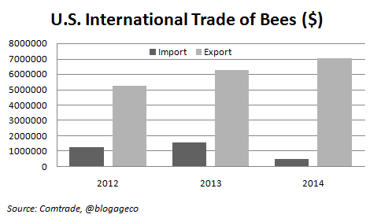
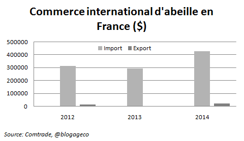
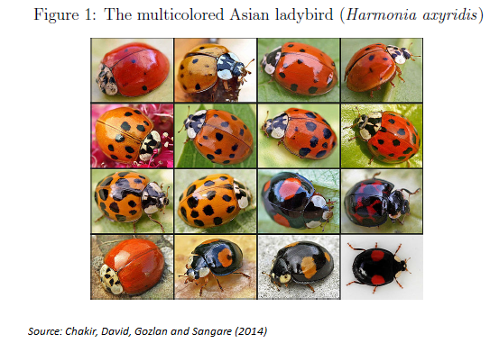
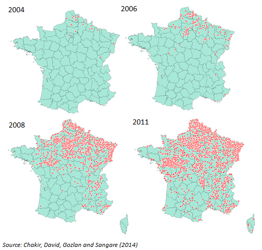
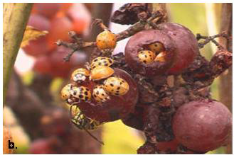

En 1952 James Meade écrit un papier théorique sur les externalités positives qu'il illustre avec un exemple qui est au cœur de ce post. Les externalités positives sont à l'opposé des pollutions, ce sont des situations où si on laisse les individus poursuivre leurs propres intérêts, ils produiront **une quantité trop faible d'un bien qui est pourtant bénéfique pour toute la société**. La main invisible ne fonctionne plus, le marché est défaillant. Habituellement on pense à la R&D. Meade aurait peut-être pu prendre l'exemple de la pile voltaïque et, un brin futuriste, aurait pu regretter que la faiblesse de la R&D ne le prive d'une voiture électrique efficiente. Plus terre à terre, il choisit l'abeille et le pommier.*

Imaginez un champ de pommier et juste à côté un apiculteur. Les abeilles pollinisent les fleurs du pommier et assurent ainsi la production de pommes. Mais notez surtout que le pollen assure aussi la production de miel. Pour Meade c'est ce dernier lien qui est central. Selon ce disciple de Keynes, nobélisé en 1977, si l'on double l'exploitation de pommiers, la quantité de miel pourrait doubler. Par contre, si l'on double le nombre d'abeilles, il y a peu de chance que le nombre de pommes soit multiplié par deux. Pour Meade l'affaire est entendue, l'apiculteur bénéficie d'une externalité positive, ses abeilles se nourrissent gratos chez le voisin et tout le monde en profite en petit déjeunant des tartines au miel (bah, ok, peut-être des miel pops) à moindre coût. Subventionnons donc cette bonne poire:

> *"The apple-farmer is paid less than the value of his marginal social net product, and the bee-keeper receives more than the value of his marginal social net product. [...] Capitalists in apple-farming should be subsidised because the unpaid benefits which they confer upon the bee-keepers more than outweigh the unpaid benefits which they receive from labour and capital employed in bee-keeping."* Meade (1952)

Si l'on quitte maintenant la période bénie de Meade (1952!), et que l'on suppose que les insecticides (et autres facteurs) ont tué en masse les abeilles, on se rend rapidement compte que l'externalité joue aussi fortement dans le sens inverse. Sans ces petites bêtes, la pollinisation devient difficile et la production fruitière est moins productive. **Pour le bien-être social, il n'y a pas assez d'abeilles**, il faut donc aider les apiculteurs.

Mais au fait la subvention est-elle la seule solution? Deux autres solutions peuvent être complémentaires pour résoudre les problèmes d'externalité, la première est la réglementation (ici concernant les insecticides) la seconde proposée par Coase est de créer un marché. Paradoxal, non? Approfondissons. Pour Coase, si les coûts de transaction sont suffisamment faibles et si les droits de propriété sont clairement définis alors les externalités peuvent être internalisées par des contrats privés. Avec la formidable baisse des coûts de transport, il est devenu possible d'acheter des abeilles et **de les transporter d'un coin des USA à un autre, simplement pour booster la production agricole** (voir photo ci-dessous pour illustration).

Oups...ça va piquer

Un marché international s'est même développé, les abeilles ont un prix et plus elles sont rares, plus elles sont chères d'où une incitation à investir dans ces petites bestioles...

## Commerce international d'abeilles

Pour ce qui est du commerce inter, allons sur le site des Nations Unies, [Comtrade](http://comtrade.un.org/db/default.aspx), à Live Animals, il y a nos chères bees (code 010641). Notons que les importations et les exportations ne sont pas totalement comparables, les imports sont en CIF (Cost, Insurance and Freight) et incluent donc les coûts commerciaux alors que les exports sont en FOB (Free on Board) soit sans les frais de transport et d'assurance.** Ci-dessous les exportations et importations des Etats-Unis vers le monde et idem pour la France sur les années 2012-2014 (pas de données avant).

Première constatation, il existe bel et bien un commerce international d'abeilles vivantes. Les Etats-Unis exportent ainsi des abeilles pour une valeur de 7 millions de dollars (le principal partenaire est le Canada)! Les USA sont un exportateur net, ce qui n'était pas évident compte tenue des difficultés rencontrées par les apiculteurs dans les années récentes. En effet les colonies d'abeilles américaines ont été affectées par un [syndrome](http://fr.wikipedia.org/wiki/Syndrome_d%27effondrement_des_colonies_d%27abeilles) d'effondrement important (colony collapse disorder), dans les années 2006-2007 près de 30% de la population a été décimée. Mais pour reprendre l'expression de Meade (et HOS) il semble que la spécialisation agricole induise un avantage relatif via un "unpaid factor of production" (le pollen de la prod agri) qui, allié sans doute à un investissement important, a permis cette position d'exportateur net.

La France est un plus petit acteur et elle est importatrice nette. Poursuivons notre étude de l'Hexagone concernant l'importation d'un autre insecte pour en analyser ses effets.

## Conséquences des importations de coccinelles asiatiques en France

Non seulement il y a un commerce d'abeilles, mais il y a aussi un commerce de coccinelles dont les motivations ne sont pas si éloignées de l'exemple précédent. Selon l'une des légendes qui entoure cet insecte, au moyen-âge alors que les pucerons mettaient en péril les récoltes, les fermiers auraient prié pour une solution miraculeuse et c'est alors qu'un essaim de coccinelle les auraient sauvé de la famine en dévorant les nuisibles, d'où leur nom de "bêtes à bon Dieu". A notre époque où la diminution des pesticides semble nécessaire, il est apparu intéressant d'utiliser ce porte bonheur. Nos coccinelles européennes (cocs à deux points) étant peu voraces, on a importé des coccinelles asiatiques, dénommées *Harmonia axyridis*.

Seul problème, l'espèce est devenue invasive... [Maia David](http://faere.fr/pub/Conf2014/harmonia_FAERE-3.pdf), que nous avons le plaisir d'accueillir dans notre labo cette année, nous a présenté son article sur le sujet et l'invasion est indéniable comme en témoigne ces cartes issues de son étude co-écrite avec Raja Chakir, Estelle Gozlan et Aminata Sangare.

Même la Corse est touchée par l'invasion.

Est-ce un problème? Ces coccinelles sont une atteinte à la biodiversité (disparition de la coccinelle indigène), elles s'installent dans les maisons, tâchent les murs de pigments rouges, dégagent un gaz désagréable mais surtout, et c'est là que ça devient inadmissible dans notre pays, **elles s'attaquent aux vignes**! Prises en flag ci-dessous, vous remarquerez comment elles s'incrustent aux raisins, une fois vendangées et broyées, elles confèrent au vin un goût âcre... Cette expérience montre que l'échange international du vivant peut parfois être problématique et a largement dépassé nos anticipations.

En fait, les nuisances sont telles que Chakir et al. (2014) montrent à l'aide d'une méthode de *choice experiment*, que le consentement à payer de la population française (l'échantillon est représentatif de la pop française et pas seulement d'une région ou d'un groupe, ce qui est rare dans ce type d'étude) pour réduire la population de cette ladybird est loin d'être négligeable.

Bon alors, on fait quoi?

Il n'y a évidemment pas de réponse simple. Lutter contre les externalités négatives, favoriser les externalités positives sont hélas des concepts largement plus faciles à énoncer qu'à appliquer.

F. Candau

Notes de bas de post  
*Simplement pour vous faire lire du Francis Bacon, voici une citation sur l'abeille et les économistes de The Economic Journal dans lequel Meade a publié son article:  
"Those who have handled the sciences have been either Empiricists or Rationalists. Empiricists, like ants, merely collect things and use them. The Rationalists, like spiders, spin webs out of themselves. The middle way is that of the bee, which gathers its material from the flowers of the garden and the field, but then transforms and digests it by a power of its own. And the true business of philosophy is much the same, for it does not rely only or chiefly on the powers of the mind, nor does it store the material supplied by natural history and practical experiments untouched in its memory, but lays it up in the understanding changed and refined. Thus from a closer and purer alliance of the two faculties- the experimental and the rational, such as has never yet been made- we have good reason for hope".  
** En soustrayant les exportations des USA vers le monde qui sont en CIF, des importations du monde en provenance des USA qui sont en FOB (non reportée ici, voir comtrade), vous obtiendrez une approximation des coûts commerciaux au commerce d'abeille américain, assurance (d'abeille) incluse.

