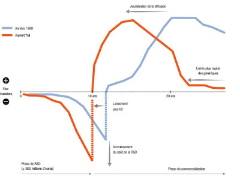
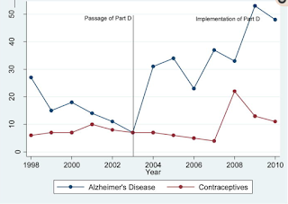

L'industrie pharmaceutique a quasiment un siècle et mériterait un long post, j'essaierai cependant de faire court en abordant principalement (mais brièvement) l'organisation concurrentielle et internationale de ce secteur. Cependant, avant cela, attardons nous quelques instants sur la découverte accidentelle par Alexander Fleming d'un champignon, le penicillium notatum. Cette moisissure allait changer la vie de l'humanité devenant quelques années plus tard le premier antibiotique, la pénicilline. La méthode de production (utilisant le maïs, découverte par le ministère de l'agriculture américain) est devenue véritablement industrielle avec la seconde guerre mondiale, impliquant plus de vingt entreprises différentes. La concurrence fut si forte qu'au sortir de la guerre, le prix de gros de la pénicilline en 300 000 doses unitaires n'était que de 3 dollars en 1945 et qu'il continua de baisser passant à 1 dollar en 1948 et à 10 cents en 1953 (Scherer, 2000).

Le succès de la pénicilline a conduit un autre chercheur, Selman Waksman à analyser de nombreux échantillons de sol au début des années 1940 et il découvre ainsi la streptomycine. Avec Waksman, une certaine méthode de la découverte venait de naître et de nouveaux antibiotiques à large spectre ont rapidement été obtenus entre 1948 et 1953. Cette méthode de "terrain" diffère de l'approche allemande de Paul Ehrlich qui développe en 1909 le premier médicament de synthèse, un arsenical actif contre la syphilis.

Ces deux modèles de recherche vont être à la base de l'industrie pharmaceutique alliant une R&D sur les effets thérapeutique de nouvelles molécules (Ehrlich) et sur des substances naturelles (Waksman).

## Contexte français

En France, c'est l'une des industries qui a connu la plus forte croissance sur les 50 dernières années ([IRDES](http://www.irdes.fr/EspaceEnseignement/ChiffresGraphiques/Cadrage/SecteurPharma/IndustriePharma.htm)). Le chiffre d'affaire de cette industrie s'élevait à 6,5 milliards d'Euros en 1970 contre 53 milliards en 2015 selon le [LEEM](http://www.leem.org/article/chiffre-daffaires-0) dont plus de la moitié est réalisée grâce aux exportations (26,2 Mrd€). Cette industrie emploierait [101 000 emplois directs](http://www.leem.org/sites/default/files/LEEM_Elements_chiffres_2014_part01+02_HD.pdf) et est caractérisée par une très forte concentration des entreprises qui a de plus augmenté au fil des ans.

## Cycle du produit

Pour comprendre un peu mieux ce secteur, une brève analyse du cycle de production d'un médicament peut être intéressante. Nous pouvons distinguer 4 temps importants :

- **La découverte et le développement** — Les méthodes de découverte ont dépassé les techniques de tâtonnement d'Ehrlich et de Waksman. La recherche de nouvelles molécules est devenue beaucoup plus rigoureuse et systématique. À partir des années 1970, des approches dites rationnelles (axées sur les mécanismes pathologiques et sur la biochimie), puis le développement de l'informatique ont permis de davantage cibler les recherches. Cependant, en dépit de ces progrès, sur les milliers de molécules analysées, seules quelques unes font l'objet d'un brevet.
- **Les tests** — Ces molécules devront ensuite passer plusieurs tests et essais cliniques avant de devenir un médicament. Les exigences de vérification se sont renforcées ces dernières années (le Stalinon en 1953, la Thalidomide en 1961, le Distilbène en 1971, puis plus récemment les scandales du Mediator, de la Dépakine etc).
- **La mise sur le marché** — Entre la découverte et la mise sur le marché, il faut compter en moyenne huit ans.
- **La fin du monopole et l'entrée des génériques.**

## Concurrence monopolistique, monopsone et régulation

Les brevets qui permettent d'exploiter un produit sur plusieurs années confèrent aux firmes de ce secteur une position de monopole sur les variétés qu'elles produisent. On parle de concurrence monopolistique. Un monopole est une entreprise qui profite de son pouvoir de marché pour fixer un prix supérieur à son coût marginal de production, ce qui cause une perte nette pour la société. Ce pouvoir de marché n'est évidemment pas sans limite : les brevets sont temporaires, et les firmes peuvent développer des molécules similaires.

Avant les années 90, les grands groupes réalisaient des profits importants avec des produits phares, dits "blockbuster", mais les brevets de nombreux blockbusters sont arrivés à terme et les stratégies "me too" se sont généralisées. Pour restaurer leur pouvoir de monopole, de nombreuses fusions et acquisitions ont eu lieu. Une stratégie de niche, dite nichebuster, s'est développée autour de l'idée de fournir des médicaments plus spécialisés sur des maladies plus rares à des prix très élevés (Lakdawalla, 2018 ; Montalban, 2011).

Pour contrebalancer ces monopoles, l'État dispose d'un pouvoir de monopsone : il représente une part importante de la demande, fixe les prix, décide de la durée des brevets et du remboursement des médicaments.

## Doit-on favoriser la concurrence dans ce secteur ?

De nombreuses études théoriques présentent les mécanismes économiques expliquant comment les brevets favorisent les innovations et la croissance économique (Romer, 1990 ; Aghion et Howitt, 1992). Les pouvoirs publics craignent qu'une réduction de ces perspectives de gains crée de mauvaises incitations en termes de R&D.

Acemoglu et Linn (2004) constatent qu'une augmentation de 1% de la taille du marché est associée à une augmentation de 4 à 6% du nombre de nouvelles entités moléculaires. Blume-Kohout et Sood (2013) montrent par exemple que l'élargissement de la couverture Medicare Part 2 à plus de 28 millions de seniors américains a entraîné une hausse de la recherche des laboratoires.

## Tous les médicaments sont fabriqués en Asie ?

La pandémie du COVID19 a révélé au grand public que la logique du commerce international s'appliquait aussi au secteur pharmaceutique. Dans les années 80, l'Europe (et notamment l'Allemagne) produisait une grande partie des produits actifs des médicaments, mais dans les années 90 et plus encore dans les années 2000, la Chine va devenir le pays de production n°1.

Le fait que le commerce mondial soit un commerce de biens intermédiaires, où la production de molécules de base est en partie délocalisée dans les pays asiatiques, fait peser le risque d'une rupture de la chaîne de production. Au États-Unis, 97% des produits servant à la production d'antibiotiques sont produits en Chine.

À cette organisation internationale s'ajoute l'adoption du *lean management* et d'une production "juste-à-temps". Le principe est de réduire les stocks, mais si cette stratégie est trop intensive, des tensions d'approvisionnement peuvent apparaître. L'Agence française du médicament comptait ainsi en 2018 que plus de 500 cas de médicaments ayant un « intérêt thérapeutique majeur » présentaient un risque de rupture d'approvisionnement.

La pandémie de la COVID a mis en évidence la fragilité de ces plans. La relocalisation des industries pharmaceutiques en Europe nécessitera plus que des discours : il faudra un engagement continuel et long des gouvernements.

## Références

- Acemoglu, D. and J. Linn. 2004. "Market Size in Innovation: Theory and Evidence from the Pharmaceutical Industry." *QJE* 119(3): 1049–90.
- Aghion, P. and P. Howitt, 1992, "A Model of Growth Through Creative Destruction," *Econometrica*, 60(2), 323–351.
- Blume-Kohout, M. and N. Sood. 2013. "Market Size and Innovation: Effects of Medicare Part D." *Journal of Public Economics* 97: 327–36.
- Lakdawalla, 2018, "Economics of the Pharmaceutical Industry," *JEL* 56(2), 397–449.
- Montalban, M. 2011. "La financiarisation des Big Pharma." *Savoir/Agir* n°16, p. 13–21.
- Romer, P. M., 1990, "Endogenous Technical Change," *JPE*, 98(5), S71–S102.
- Scherer, F. M. 2000. "The Pharmaceutical Industry." In *Handbook of Health Economics*, Vol. 1B.
