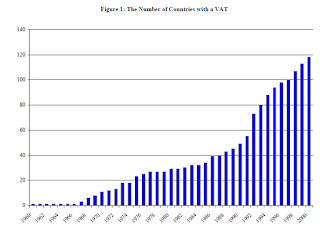
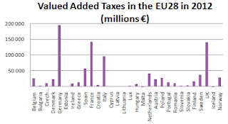
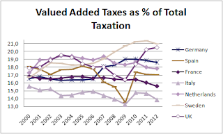
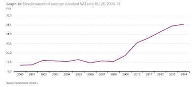
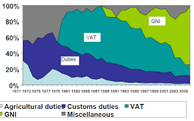

> *"La réforme fiscale, c'est quand vous promettez de réduire les impôts sur les choses qui étaient taxées depuis longtemps et que vous en créez de nouveaux sur celles qui ne l'étaient pas encore"* Edgar Faure.

Edgar Faure savait de quoi il parlait lorsqu'il définissait ainsi la réforme fiscale puisqu'il était ministre des finances lorsque la TVA est instaurée en 1954. Initialement la TVA touche uniquement les industriels puis elle est généralisée en 1968 et remplace alors **14 taxes différentes** (selon cette [campagne d'information d'époque](http://player.ina.fr/player/embed/CAF97030671/1/1b0bd203fbcd702f9bc9b10ac3d0fc21/460/259) qui vaut le détour).

Si vous ne connaissez rien à la TVA, ne zappez pas, voici une vidéo pour quelques pré-requis (merci à Martin Anota pour l'indication).

<iframe allowfullscreen="" frameborder="0" height="266" src="https://www.youtube.com/embed/fh2Uy5M1NS4?feature=player_embedded" width="320"></iframe>

Dans ce post nous allons élargir le champs d'étude en analysant les taux de TVA en Europe, en étudiant les conséquences de la TVA (cet impôt est-il injuste? Offre t-il un gain de compétitivité?) et ses extensions (TVA sociale, TVA environnementale).

## Origines et succès

La TVA est une invention française, lit-on souvent, c'est évidemment faux mais la France fut effectivement la première nation à l'appliquer. L'idée de la TVA semble ainsi être apparue de façon claire pour la première fois sous la plume d'un économiste allemand Von Siemens (1918) puis américain, Adams (1921) dans cet article du [QJE](http://www.jstor.org/stable/1882424?seq=1#page_scan_tab_contents). Son promoteur en France a eu un parcours remarquable, [Maurice Lauré](http://www.lajauneetlarouge.com/article/maurice-laure-36-1917-2001#.VUNx-U1OJjo) né à Marrakech, a fait ses études à Rabat puis à Saigon, il est finalement diplômé de l'X en 36, puis fait prisonnier durant la seconde guerre mondiale, il devient ensuite haut fonctionnaire et propose la TVA en 1952 qui est adoptée deux ans plus tard. Cette nouvelle taxe paraît bien **difficile à collecter**, la comptabilité telle que nous la connaissons aujourd'hui n'existait évidemment pas, elle est donc uniquement imposée sur le secteur de la production et ne sera généralisée au commerce de détails qu'en 1968. Dès les années 70 cette taxe devient **l'une des plus importante ressource fiscale pour l'Etat français**. Elle l'est encore aujourd'hui, puisque seules les cotisations sociales en France rapportent plus que la TVA dont les montants récoltés dépassent largement ceux d'autres prélèvements, tel que l'impôt sur le revenu par exemple.

La TVA semble ainsi être une formidable "machine à cash", aussi il n'est guère étonnant qu'elle ait été adoptée dans plus de 150 pays. Ci-dessous un graphique issu de l'étude de Keen et Lockwood (2007) qui montre l'adoption de la TVA dans le monde. Le nombre de pays (en ordonnée) ayant adopté cette taxe a ainsi plus que doublé entre 1990 et 2000 passant de 55 à 120 pays.

{#fig-keen}

## TVA et l'Europe

En France, la TVA permet de récolter dans les 145 milliards d'Euro soit à peu près la même somme que la TVA anglaise (voir graph ci-dessous, source eurostat).

{#fig-recettes}

La crise de 2007-08 a eu pour effet une diminution de la part de la contribution de la valeur ajoutée dans les recettes fiscales des pays. Au début de la crise, cette baisse ne peut s'expliquer par une baisse des taux (seul le Portugal abaisse son taux de TVA) mais trouve plutôt son origine dans une chute de la demande. Les faillites expliquent aussi que certaines entreprises n'aient pas restituées aux Etats les taxes collectées sur les produits vendus dans l'année. En 2009, de nombreux pays abaissent leurs taux de TVA, souvent sur des produits spécifiques. La France sur la restauration (TVA à 5,5%), l'Allemagne sur les hôtels (7%). D'autres abaissent le taux général, comme par exemple l'Irlande (de 21,5% à 21%) et le Royaume-Uni (de 17% à 15%).

{#fig-taux}

En 2010, cette tendance à la baisse se révèle temporaire. L'augmentation des dépenses publiques liées à une augmentation du chômage conduit les gouvernements à hausser les taux de TVA. La crise de la dette de 2011 renforce cette tendance. Les dettes de certains pays sont jugées trop importantes par les marchés financiers, l'endettement pour financer les déficits nécessite désormais de payer une prime de risque bien plus élevée. La soudaine hausse des taux d'intérêt dans des pays tels que la Grèce, le Portugal, l'Espagne ou encore l'Italie diffuse une inquiétude croissante chez les gouvernants sur la question de la soutenabilité de la dette. Alors que **de nombreux économistes rejettent les politiques d'austérité en période de crise** (à l'international c'est sans doute le FMI qui a le plus critiqué les thèses promouvant l'austérité, [travaux empiriques à l'appui](http://www.imf.org/external/pubs/ft/weo/2010/02/pdf/c3.pdf). En France, c'est peut-être l'OFCE qui s'est exprimé de la façon la plus claire sur le sujet), les gouvernements de gauche comme de droite, pensent qu'il est plus responsable de hausser les niveaux de taxation.... La commission européenne et la BCE partagent de plus cet avis comme en témoigne ce [point de vue](http://www.ecb.europa.eu/press/key/date/2010/html/sp100624.en.html) de JC Trichet soutenant que l'austérité peut être expansionniste car elle rétablit la confiance dans la capacité des Etats à tenir leurs engagements.... En moyenne **le recours à une hausse de la TVA a été continu**.

{#fig-evolution}

En France on s'est écharpé sur la TVA sociale (politique visant à abaisser les cotisations sociales et à compenser la perte de recette par une hausse de la TVA) en 2012, le débat avait finalement été gagné par la gauche, cette politique, ayant pour but officiel de créer des emplois en élevant le coût du capital et en diminuant celui du travail, n'a finalement pas été adoptée compte tenu de la faible élasticité de substitution entre capital et travail sur le court terme, laissant présager un coup d'épée dans l'eau (voir [Carbonnier](http://www.sciencespo.fr/liepp/sites/sciencespo.fr.liepp/files/LIEPP-PB-1-TVA-sociale_1_0.pdf) pour une discussion informée). Puis le vent a tourné et il est redevenu "responsable" de baisser les cotisations et d'augmenter la TVA... En 2014, la TVA a été augmentée passant de 19,6 à 20% pour le taux normal et de 7% à 10% pour le taux intermédiaire.

## Impact de la TVA

La TVA est **régressive**, que l'on soit riche ou pauvre, on paye le même taux. Pour limiter cet effet sur le pouvoir d'achat des plus modestes, plusieurs taux sont appliqués et suivant les pays certains produits sont exonérés de taxe. Par exemple en Australie, au Canada et au Japon, où la mise en place de la TVA a été particulièrement difficile, de nombreux aménagements ont été réalisés (d'après James, 2011). Aux Etats-Unis, les démocrates se sont souvent opposés à la mise en place de la TVA principalement pour cette raison de justice sociale et pour les risques d'échec politique qu'une telle taxe pouvait représenter (les républicains s'y opposent craignant que cette taxe renforcent les ressources et la puissance de l'Etat).

L'autre effet de la TVA, souvent mis en avant par les journalistes, est son impact sur la **compétitivité des entreprises**. En effet, puisqu'elle touche les produits importés, mais qu'elle peut être déduite par les exportateurs il semble logique qu'elle ait un impact favorable sur la balance commerciale. Pour les économistes en économie internationale, ce raisonnement est un raccourci erroné. Feldstein et Krugman (1990) ont ainsi des mots durs à l'encontre de ce raisonnement:

> *In large part, the belief that VATs are trade-distorting policies reflects **a failure** on the part of noneconomists **to understand the basic economic arguments**.*

En effet, le raisonnement basique conduit à considérer que le taux de change va s'ajuster à l'introduction ou à la modification d'une TVA dans un pays. Cependant dans une zone monétaire non harmonisée l'impact d'un différentiel de TVA peut avoir des conséquences économiques. Voir aussi Desai et Hines (2005) ont réalisé une étude sur la question pointant d'autres raisons expliquant l'impact de la TVA sur le commerce (les déductions de TVA pour les exportateurs sont parfois incomplètes, les différences de TVA sur les biens exportés et non échangés ont aussi un impact etc).

## En guise de conclusion, quelques mots sur une taxe européenne

Le traité de Rome établit que l'Europe doit évoluer vers un système de ressources propres (article 201: "without prejudice to other revenue, the budget shall be financed wholly from own resources") mais les Etats s'y sont toujours opposés et l'histoire de la TVA européenne ne fait pas exception à cette règle. Avec la chute des recettes des droits de douane et l'augmentation des dépenses européennes, il a fallu trouver de nouvelles recettes dans les années 60, la TVA ne tarde pas à être au cœur des discussions. Deux méthodes de prélèvement sont proposées par la commission une première dite **déclarative**, mais que je qualifierais de "désagrégée" où les TVA européennes et nationales sont prélevées sur chaque produits (avec un décompte sur chaque ticket de caisse identifiant les deux taux) et une autre méthode, dite **statistique** où une part de la TVA récoltée par les Etats est transférée vers l'Europe. La première méthode avait l'avantage d'être transparente mais politiquement elle rendait l'Europe un peu trop indépendante. Officiellement, le coût administratif d'une telle procédure a fait la voie belle à la méthode statistique (aujourd'hui avec l'informatique le coût administratif serait bien moindre, mais l'idée semble appartenir au passé).

Initialement le taux est fixé à 1% et la base fiscale ne peut excéder les 55% du PIB. Puis de multiples négociations ont eu lieu, à commencer par le Royaume-Uni qui obtient une ristourne dès 1984 (le fameux "juste retour"), puis l'Allemagne, la Suède etc... Depuis 2007 le taux a été revu à la baisse passant à 0.3% (avec les exceptions précédemment citées, l'Allemagne 0.15% par exemple). Au final, ce transfert n'est pas vraiment une taxe européenne sur la valeur ajoutée, elle n'est guère différente d'une contribution directe des Etats ce qui explique pourquoi elle est supplantée par ce mode de financement (contribution basée sur le Gross National Income, GNI, sur le graph ci-dessous et VAT pour TVA. Source: European commission).

{#fig-resources}

La TVA européenne pourrait-elle cependant renaître sous une forme nouvelle? C'est l'idée d'une **Taxe sur le Carbone Ajouté** (TCA), défendue par Eloi Laurent et Jacques Le Cacheux il y a déjà fort longtemps [ici](http://www.ofce.sciences-po.fr/pdf/lettres/311.pdf), qui comme son nom l'indique s'inspirerait de la TVA mais sur le contenu en carbone. Trois oppositions sont souvent avancées, la première est qu'il faudrait une comptabilité du carbone et que nous ne l'avons pas... Avec une telle critique la TVA n'aurait jamais été mise en place (il est intéressant de se rappeler que la TVA semblait par exemple inapplicable pour le commerce de détails et qu'il a fallu des années pour que le système soit généralisé). La deuxième critique considère qu'une telle politique serait du protectionnisme caché et qu'elle aboutirait à des représailles de la part des partenaires commerciaux. Enfin, le consommateur le plus pauvre verrait son pouvoir d'achat fortement réduit, d'où l'idée de compenser cette perte par des allègements fiscaux. Je dois avouer que je trouve l'idée de la TCA à la fois attirante et inquiétante, il n'empêche qu'elle constitue à n'en pas douter une véritable réforme fiscale au sens d'Edgar Faure.

F.C.

## Biblio (partielle)

- Desai, Hines, 2005. Value-Added Taxes and International Trade: The Evidence.
- Feldstein, M, P Krugman, International trade effects of value-added taxation, in Assaf Razin and Joel Slemrod eds., Taxation in the global economy (Chicago: University of Chicago Press, 1990), 263-278.
