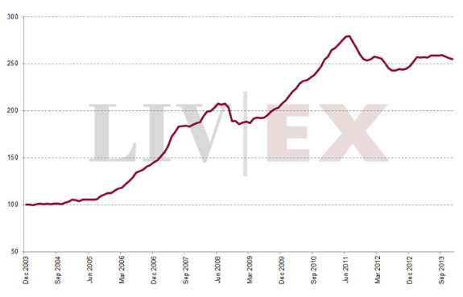

L'économie du vin est un domaine particulièrement intéressant pour l'analyse économique. Commençons par l'information imparfaite qui y règne en maître expliquant prix et organisation.

Le vin est un bien d'expérience comme le définissait Nelson (1970), c'est à dire un bien dont la qualité ne peut pas être connue avec certitude avant consommation (ex-ante). Il peut aussi parfois avoir les caractéristiques d'un bien de croyance, soit un bien dont on ne peut même pas évaluer la qualité après consommation (typiquement lorsqu'un néophyte après dégustation vous dit "j'y connais rien, mais il est bon" en lisant l'étiquette ou en vous narrant les commentaires du vendeur).

Cette information imparfaite conduit les consommateurs à se faire une idée de la qualité en considérant un prix moyen, de prime abord un prix élevé est donc un signal de bonne qualité. Mais rien n'empêche les mauvais producteurs de vendre leur piquette à un prix élevé pour se faire passer pour ce qu'ils ne sont pas. Pour légitimer leur prix, les producteurs de bon vin vont exhiber leurs coûts de production (du moins auprès des experts), démontrant ainsi qu'ils ont réalisé des investissements hors de portée des producteurs low-costs. Pour ceux qui sont intéressés par ces interactions, voir l'article de [Mahenc et Meunier (2006)](http://mit.econ.au.dk/vip_htm/vmeunier/papiers/earlysalesapril06.pdf) qui appliquent finement les concepts de l'économie industrielle à l'économie du vin.

En ce qui concerne l'organisation du secteur, l'information imparfaite explique l'existence de plusieurs emplois intermédiaires entre les producteurs et les consommateurs dont notamment la profession d'expert. Leur fonction est de restaurer l'information. Seul hic, ces mêmes experts peuvent manipuler/fausser le marché. L'effet Parker, du nom de Robert Parker l'éditeur de wine advocate, est ainsi très connu tant son jugement influence les prix. Selon Ali, Lecocq et Visser (2008) qui utilisent une expérience quasi-naturelle, ce gourou nous coûterait en moyenne 3 euros par bouteille de Bordeaux.

Outre cet effet direct de l'expérience, le vin est aussi un investissement plus ou moins risqué, un vin de garde par exemple révèle ses qualités en vieillissant, il est donc "plus ou moins" difficile de prédire ses caractéristiques sur le long terme. Pourquoi "plus ou moins"? Pour une raison simple (et encore une fois on retourne aux fondamentaux), la prédiction est possible mais il faut connaître les caractéristiques de l'offre. Ashenfelter (2008) montre ainsi qu'une simple équation économétrique intégrant les caractéristiques des sols et les conditions climatiques explique 80% de la variation moyenne des Bordeaux. L'auteur montre aussi comment les experts ont par le passé négligé ces caractéristiques qui constituent pourtant l'essence de la qualité d'un vin. Gergaud et Ginsburgh (2008) affinent l'analyse et montrent que les dotations du sol ne sont rien en comparaison du travail des vignerons, la qualité d'un vin est davantage une question de technique qu'une question de nature. Evidemment il n'y a rien de révolutionnaire dans ces découvertes, Vauban sous Louis XIV ne disait-il pas que "*le meilleur terroir ne diffère en rien du mauvais s'il n'est cultivé*" (cette citation est empruntée à cet [article](http://www.voxeu.org/article/wine-tasting-terroir-joke-andor-are-wine-experts-incompetent)).

Pour conclure, comment expliquer la forte augmentation des prix observés dans les années 2000 sur les 1000 plus grands vins du monde (voir graph ci-dessous)?

Cette forte augmentation peut en partie s'expliquer par la croissance des revenus dans les pays émergents*. Les grands crus sont des produits de luxe, c'est à dire des biens dont l'élasticité revenu est supérieure à un, d'où un effet direct et puissant de la croissance sur les prix. En effet puisque la demande pour ces vins augmente encore plus vite que les revenus et que l'offre est fixe sur le court terme, les prix ont flambé. Je vous laisse faire le graphique offre/demande. Rajoutez à ceci que les vins sont des placements financiers (liquides) assez prisés et vous voilà en mesure d'expliquer la hausse des prix (puis stagnation) du vin avec des arguments micro de base.

F. Candau

*que l'on pourrait résumer par "pour cent BRICs, t'as du vin", dès lors plutôt normal que les [lendemains soient difficiles](http://blog.francetvinfo.fr/classe-eco/2013/08/29/pour-cent-brics-tas-plus-rien.html)

## Références

- Ali, H. H., Lecocq, S. and Visser, M. (2008), The Impact of Gurus: Parker Grades and En Primeur Wine Prices. The Economic Journal, 118: F158–F173.
- Ashenfelter, O. "Predicting the quality and prices of Bordeaux wine. The Economic Journal 118
- Gergaud, O and Ginsburgh, V (2008), "Endowments, production technologies and the quality of wines in Bordeaux. Does terroir matter?", *The Economic Journal* 118, 142-157.
