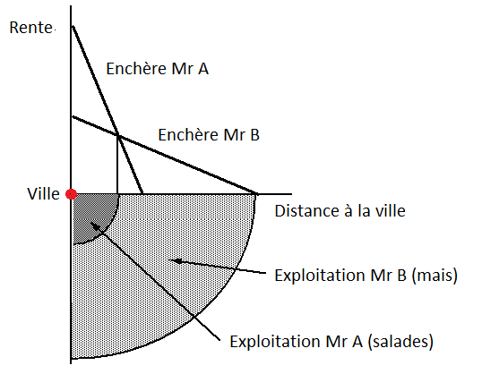
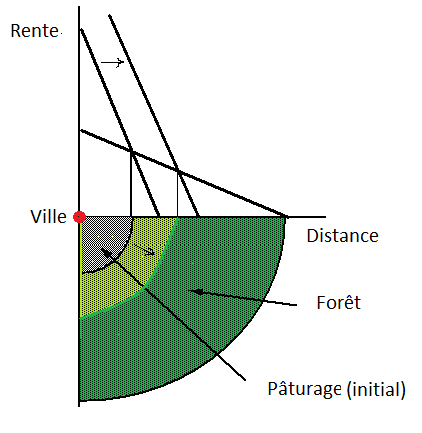

{width=200}

Comment les activités s'organisent-elles dans l'espace? Pour répondre à cette question la plupart des enseignements d'économie spatiale débutent par le modèle de von Thünen. Après la description du modèle, je l'utiliserai pour quelques digressions sur l'étalement urbain et sur la déforestation de l'Amazonie.

## Le modèle

L'objectif initial de von Thünen est d'expliquer l'organisation des activités agricoles dans l'espace, il considère une ville entourée de terre. Les biens agricoles sont transportés en ville où ils sont vendus. Le marché agricole est considéré concurrentiel et les coûts de transport des biens produits sont linéaires ($t_{i}$). Pour simplifier, et surtout pour mettre en exergue les coûts de transport, je suppose que les coûts de production ($c$) sont identiques d'une exploitation à l'autre. Chaque localisation est identifiée par sa distance $d$ à la ville. Les terres sont allouées aux agriculteurs suivant un processus d'enchère. Chaque producteur, qu'il produise du blé ou des salades, fait une offre en fonction des profits, notés $\pi_{i}$ qu'il pourra retirer de sa production, notée $q$. Les profits d'une activité localisée en $i$ s'écrivent:

$\pi_{i}=(p_{i}-c-t_{i}d)q_{i}-r_{i}$

où *r* est la rente foncière payée par l'agriculteur. Le premier membre de l'expression qui est le profit brut (sans considération du prix de la terre) est l'enchère maximale proposée par l'exploitant (bid rent en anglais). Comme il y a concurrence dans la salle d'enchère, la rente sur le marché sera égale à l'enchère maximale (profit nul) ce qui nous donne:

$r_{i}=(p_{i}-c-t_{i}d)q_{i}$

Une relation inverse est donc observée entre le prix de la terre (i.e la rente de localisation) et la distance au marché, plus précisément observons comment varie la rente avec la distance en dérivant:

$\frac{\partial r_{i}}{\partial d}=-t_{i}q_{i}$

Ainsi ceux qui espèrent produire beaucoup sur de petites quantités de terre (ex: producteur de salades) seront prêts à payer cher le fait d'être proche de la ville (avec les productions hors sol, ils sont même parfois dans la ville désormais). De la même façon ceux qui ont un coût de transport élevé se localiseront au plus près du marché. En bon classique, von Thünen prend des coefficients fixes, soit pour produire une unité d'un bien, il faudra $a_{i}$ unité de terre. La fonction de production par unité de terre est donc $q_{i}=1/a_{i}$ mais on peut très bien généraliser et obtenir les mêmes résultats (voir Fujita et Thisse, 2003).

Pour illustrer le modèle, prenons deux agriculteurs A et B dont un producteur A qui a une production plus intensive que le producteur B, soit $a_{A}<a_{B}$ ou si vous préférez $q_{A}>q_{B}$. Le producteur A proposera une enchère plus élevée, puisqu'une unité de terre lui permet de produire plus. Prenez des valeurs pour les coef techniques des deux agents, idem pour les coûts de transport et vous pourrez tracer la rente en fonction de la distance grâce à l'équation précédente.

{#fig-geluck width=320}

L'intersection des deux droites vous donnera le point pour lequel A n'est plus intéressé par la localisation dont B devient le propriétaire. En égalisant les rentes on obtient la limite de l'exploitation de A et le début de celle de B. Ce modèle a ensuite été étendu à l'économie urbaine, il explique alors pourquoi les faibles revenus se localisent en banlieue où le prix du sol est faible alors que les hauts revenus se localisent près du centre d'affaire ou de consommation.

## Discussions

Ce modèle ne s'applique pas en tant que tel, c'est évidemment une parabole qui permet de mieux comprendre l'utilisation des sols. Par exemple, pourquoi nos villes s'étalent-elles de façon continue depuis près de 50 ans? Cet étalement urbain peut s'expliquer par la croissance des revenus en ville qui concurrence le secteur agricole dans l'utilisation des sols. De plus, la baisse des coûts de transport a permis a une classe moyenne de plus en plus importante de se localiser dans le périurbain. En clair, si les coûts de transport venaient à augmenter et/ou si les producteurs agricoles gagnaient mieux leur vie aux abords des villes, on obtiendrait des villes plus denses.

En somme, l'important apport de von Thünen est de démontrer la puissance organisatrice des transports et du marché pour ordonner l'utilisation des sols. Un autre point intéressant est la tension entre les forces d'agglomération et de dispersion, le désavantage d'une localisation distante et/ou d'une production peu intensive est compensé par un prix du sol plus faible (et vice versa pour les coûts de transport élevé et/ou pour les productions intensives). Au cœur de ce modèle réside l'idée d'une spécialisation de l'espace via l'échange (voir Limao et Venables (2002) qui intègrent von Thünen dans un modèle HOS) et de ce point de vue l'analyse de la déforestation en Amazonie est intéressante à analyser.

A partir des années 70-80 le Brésil se dote d'une industrie agro-alimentaire moderne, le Brésil va être nommé la ferme du monde, avec des filières agro-exportatrices puissantes dans le soja, l'éthanol, le sucre et le bœuf etc. La hausse des profits a permis à l'industrie de s'étendre, de produire toujours plus loin, le rachat de terre par les industriels a été une incitation pour les plus pauvres à brûler la forêt amazonienne premièrement pour l'exploiter (pâturage) mais aussi dans l'espoir d'obtenir un titre de propriété de sorte à pouvoir vendre ensuite (au bout de x années qu'une terre était exploitée, elle devenait la propriété des sans terres). Vous voyez le cercle vicieux...

{#fig-foret}

Ainsi à partir des années 70 l'Amazonie a commencé à fondre comme neige au soleil. Dans les années 90 c'est la forte valorisation du prix du soja qui a accentué cette déforestation.

Les géographes et les économistes utilisent ainsi le modèle de von Thünen, non pas stricto sensu, mais plutôt comme une justification à l'intégration de certaines variables (e.g. distance au marché) dans leurs analyses empiriques. Sur la déforestation amazonienne voir notamment Caldas et al. (2007) qui discutent du modèle de von Thünen et Cropper, Griffiths et Mani (1999) qui s'en inspirent dans leur analyse de la déforestation en Thaïlande.

En conclusion citons l'un des plus grands experts d'économie urbaine, Masahisa Fujita:

> *"In my opinion, Thünen's thinking was not only amazingly advanced for his time, but in many respects remains novel even today. It is shown that if we unify Thünen's well-known theory on agricultural land use with this pioneering work on industrial agglomeration by using modern tools, then we essentially come up with a prototype of New Economic Geography model."*

L'article est disponible [ici](http://www.rieti.go.jp/jp/publications/dp/11e074.pdf) (publié en 2012 dans Regional Science and Urban Economics).

F. Candau

## Références

- Caldas M, R Walker, E Arima, S Perz, S Aldrich, C Simmons, 2003. Theorizing Land Cover and Land Use Change: The Peasant Economy of Amazonian Deforestation. Annals of the Association of American Geographers, 97(1), 2007, pp. 86–110
- Cropper M, C Griffiths; M Mani. 1999. Roads, Population Pressures, and Deforestation in Thailand, 1976-1989. Land Economics, Vol. 75, No. 1., pp. 58-73
- Fujita M, J-F Thisse, 2003. Economics of Agglomeration; Cities, Industrial Location and Regional Growth, Cambridge University Press, Cambridge.
- Limao N, A Venables, 2002, Geographical disadvantage: a Heckscher–Ohlin–von Thünen model of international specialisation. Journal of International Economics, 2002.
