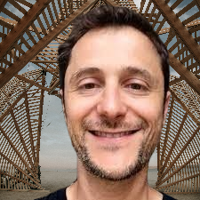

::: {.home-intro}
::: {.bio}
Welcome! I am a professor of economics at [UPPA (UMR TREE)](https://tree.univ-pau.fr/) in France.

I work on many topics. Perhaps too many, but that is my nature and my pleasure. There is an old parable, dating back to [Erasmus](https://en.wikipedia.org/wiki/Erasmus) and revisited by [Isaiah Berlin](https://en.wikipedia.org/wiki/The_Hedgehog_and_the_Fox), distinguishing thinkers between hedgehogs, who see the world through one big idea, and foxes, who roam across many questions without a single organizing principle. I am decidedly a fox. Rather than applying one framework to every problem, I have followed questions wherever they led — from cities to globalization to the environment — and each detour has shaped how I think about the next one. Yet even a fox picks up a few convictions along the way. From economic geography, I have learned that activities operating under increasing returns — industry, software, platforms — cast a long shadow on cities, producing agglomeration rents and hysteresis. From international economics, I have learned that globalization carries hidden costs and that large countries exert a disproportionate pull on the world economy. And from the environmental and ecological sciences, I have come to see that many of our policies are incomplete, sometimes backfire, and remain far too anthropocentric. You will not find a grand theory here, but a bit of many of them.
:::

::: {.contact}
{width=140 style="border-radius: 6px; display: block; margin: 0 auto 0.8rem;"}

[Curriculum Vitae](Home/cv2023.pdf) — [Google Scholar](https://scholar.google.com/citations?user=Cy_hOg0AAAAJ)
:::
:::

## Work in Progress

::: {.wip-columns}

<h3>Environmental Economics</h3>
<ul class="paper-list">
<li>
<strong>The Hidden Cost of Globalization in the Underwater World: Evidence from California's Kelp Forests</strong>

With Florian Lafferrere.

<a href="Research/DiD11.pdf">Working paper</a>

</li>
<li>
<strong>Invasive Species and Ballast Water From the United States</strong>

With Florian Lafferrere and Julie Schlick.

<a href="Research/BWE_IAS.pdf">Preliminary work</a>

</li>
</ul>

<h3>Economic Geography</h3>
<ul class="paper-list">
<li>
<strong>The Effect of High-Speed Internet on Working from Home</strong> (2025)

With Lauriane Belloy and Younoussa Abdoulhazis-Oumarou.

<a href="Research/High_Speed_Internet_Remote_Work.pdf">Working paper</a> <a href="Research/HSI_all.zip">Matlab and R code</a>

</li>
<li>
<strong>Labor Adjustment Costs in French Viticulture: Evidence from Trade-Cost Shocks</strong>

With Laure Latruffe.

<a href="Research/Adjust_L_Demand.pdf">Working paper</a>

</li>
</ul>

:::
