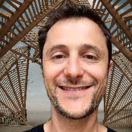

::: {.home-intro}
::: {.bio}
Welcome! I am a professor of economics at [UPPA (UMR TREE)](https://tree.univ-pau.fr/) in France.

You can find my writings here.
:::

::: {.contact}
{width=140 style="border-radius: 6px; display: block; margin: 0 auto 0.8rem;"}

[Curriculum Vitae](Home/cv2023.pdf) — [Google Scholar](https://scholar.google.com/citations?user=Cy_hOg0AAAAJ)
:::
:::

## Working Papers

::: {.wip-columns}

<h3>Environmental Economics</h3>
<ul class="paper-list">
<li>
<strong>The Hidden Cost of Globalization in the Underwater World: Evidence from California's Kelp Forests</strong>

With Florian Lafferrere.

<a href="Research/DiD11.pdf">Working paper</a>

</li>
</ul>

<h3>Economic Geography</h3>
<ul class="paper-list">
<li>
<strong>Trade Competition and the Rise of the French Left: The Algerian Wine Shock, 1893–1914</strong>

With Christophe Lévêque.

<a href="Research/ATS2.pdf">Working paper</a>

</li>
<li>
<strong>Slow to Hire, Slow to Fire: Labour Adjustment Frictions in French Viticulture</strong>

With Laure Latruffe.

<a href="Research/Adjust_L_Demand.pdf">Working paper</a>

</li>
</ul>

:::

## Under Revision

<ul class="paper-list">
<li>
R&amp;R at Ecological Economics: <strong>Unintended Consequences of a Clean Regulation: How the U.S. Ballast Water Act Led to Transboundary Invasion of Alien Species</strong>

With Florian Lafferrere and Julie Schlick.

<a href="Research/BWE_IAS.pdf">Working paper</a>

</li>
<li>
R&amp;R at Regional Science and Urban Economics: <strong>The Effect of High-Speed Internet on Working from Home</strong>

With Lauriane Belloy and Younoussa Abdoulhazis-Oumarou.

</li>
</ul>
